# Blood Donation Platform - Complete Development Context

**Project:** LifeLink Blood Donation Platform  
**Version:** 1.0  
**Last Updated:** November 22, 2025  
**Purpose:** Comprehensive development guide for AI-assisted coding

***

## Table of Contents

1. [Product Requirements Document (PRD)](#1-product-requirements-document-prd)
2. [Tech Stack Specifications](#2-tech-stack-specifications)
3. [Database Schema](#3-database-schema)
4. [Cursor Rules (.cursorrules)](#4-cursor-rules-cursorrules)

***

# 1. Product Requirements Document (PRD)

## 1.1 Project Overview

**Product Name:** LifeLink Blood Donation Platform  
**Vision:** An on-demand blood donation platform inspired by ride-sharing logistics (like Rapido), transforming blood donation coordination into a seamless, community-driven, life-saving experience.

**Target Audience:**
- Primary: Rotaract Club members and community volunteers
- Secondary: Hospitals, blood banks, healthcare providers, general public

**Core Value Proposition:**
- Real-time matching of blood donors with recipients
- Transparent, rewarding, and efficient donation process
- Tangible impact tracking and community engagement
- Emergency response with intelligent logistics

***

## 1.2 User Roles

### Role 1: Donor
**Description:** Individual who can donate blood

**Capabilities:**
- Maintains profile with blood group, medical history, location
- Receives notifications for matching requests
- Tracks donation history and impact
- Schedules appointments at blood drives/centers
- Participates in gamification features

**Access Level:** Standard user with donor-specific permissions

***

### Role 2: Recipient
**Description:** Individual or hospital representative needing blood

**Capabilities:**
- Can post urgent blood requests
- Views available donors by location and blood type
- Communicates directly with matched donors
- Tracks request fulfillment status

**Access Level:** Standard user with recipient-specific permissions

***

### Role 3: Hospital/Blood Bank Admin
**Description:** Healthcare facility representative

**Capabilities:**
- Manages blood inventory levels
- Posts institutional blood requirements
- Accesses priority matching for partner institutions
- Views analytics and supply/demand data
- Manages appointment slots for donation centers

**Access Level:** Elevated permissions for institutional management

***

### Role 4: Rotaract Club Coordinator
**Description:** Community organizer role

**Capabilities:**
- Organizes blood donation drives/events
- Manages team challenges and leaderboards
- Views club-level statistics and impact
- Moderates community features

**Access Level:** Event management and community moderation permissions

***

### Role 5: System Administrator
**Description:** Platform oversight and management

**Capabilities:**
- User verification and approval
- Content moderation
- System analytics and reporting
- Partnership management

**Access Level:** Full system access

***

## 1.3 Core Features by Phase

### Phase 1: Core On-Demand MVP (3-4 months)

#### Feature 1.1: User Registration & Verification
**Priority:** P0 (Critical)  
**User Story:** As a new user, I want to create an account and verify my identity so that I can safely participate in the platform.

**Functional Requirements:**
- Email/phone number registration with OTP verification
- Profile creation with:
  - Blood group selection (A+, A-, B+, B-, AB+, AB-, O+, O-)
  - Medical history questionnaire (15-20 questions)
  - Current location (GPS-based with permission)
  - Last donation date (for donors)
  - Emergency contact information
- Multi-factor authentication (email/SMS OTP)
- Document upload for identity verification (ID card, driver's license)
- Manual admin approval workflow (24-48 hour SLA)
- Profile editing and privacy settings
- Account deactivation/deletion option

**Acceptance Criteria:**
- [ ] User can register with email or phone number
- [ ] OTP sent within 30 seconds
- [ ] Profile form validates all required fields
- [ ] Document upload supports JPEG, PNG, PDF formats (max 5MB)
- [ ] Admin dashboard shows pending verifications
- [ ] Verified users receive notification
- [ ] Profile data encrypted at rest

**Edge Cases:**
- User with rare blood type (show special badge)
- Incomplete medical history (prompt to complete with deadline)
- Failed verification attempts (3 max, then account lock for 24h)
- Minor users (require guardian consent with legal disclaimer)
- Users changing location/relocating (update with location history)
- Users with temporary medical ineligibility (show countdown to eligibility)

**Technical Notes:**
- Use Supabase Auth for authentication
- Store medical history encrypted using pgcrypto
- Implement Row-Level Security (RLS) policies
- Use PostGIS for location data

***

#### Feature 1.2: Intelligent Matching & Location-Based Services
**Priority:** P0 (Critical)  
**User Story:** As a recipient, I want to find nearby donors with matching blood type so that I can quickly get blood during emergencies.

**Functional Requirements:**
- Matching algorithm considers:
  - Blood type compatibility (exact match + universal donors)
  - Geographical proximity (radius-based search: 5km, 10km, 25km, 50km)
  - Donor availability status (online/offline)
  - Donation eligibility (90-day gap for whole blood)
  - Donation history (preference to active donors with 2+ donations)
  - Response time (historical average)
- Interactive map interface showing:
  - Donor locations (approximate for privacy, not pinpoint)
  - Recipient/hospital locations (exact)
  - Nearby blood banks (integrated Google Maps API)
  - Partner hospitals with priority badge
- Distance calculation and estimated travel time (Google Distance Matrix API)
- Filter options:
  - Blood type (multi-select)
  - Distance radius (slider: 5km-50km)
  - Availability status
  - Donor rating (Phase 2)
- Urgency level indicators:
  - Critical (red, <1 hour needed)
  - Urgent (orange, 1-6 hours)
  - Routine (green, 24+ hours)
- Automatic radius expansion if no matches found

**Acceptance Criteria:**
- [ ] Matching algorithm returns results in <3 seconds
- [ ] Map displays 100+ markers without lag
- [ ] Distance calculation accurate within 5%
- [ ] Universal donors (O-) appear in all searches
- [ ] Filters update map in real-time
- [ ] Mobile map supports pinch-to-zoom and pan
- [ ] Location privacy: donors see approximate recipient location, recipients see approximate donor locations

**Edge Cases:**
- No matches found in immediate area (expand radius to 25km, 50km, then notify blood banks)
- Multiple simultaneous requests for same donor (first-come-first-served with 5-minute response window)
- Donor location outdated or inaccurate (prompt to update location)
- Requests in remote/rural areas with sparse donor pool (suggest nearest blood bank)
- Universal donor matching during emergencies (notify all O- donors within 50km)
- Blood type incompatibility false positives (implement strict validation)

**Technical Notes:**
- Use PostGIS ST_DWithin for geospatial queries
- Implement caching for frequently searched areas (Redis)
- Use Google Maps JavaScript API for map rendering
- Index blood_type and location_coordinates columns
- Implement pagination for large result sets

***

#### Feature 1.3: Real-Time Communication & Notifications
**Priority:** P0 (Critical)  
**User Story:** As a donor, I want to receive instant notifications when someone needs my blood type so that I can respond quickly during emergencies.

**Functional Requirements:**
- In-app messaging system:
  - One-to-one chat between donors and recipients
  - Message encryption (end-to-end)
  - Read receipts and typing indicators
  - Message history (retained 90 days)
  - Block/report abusive users
- Push notifications for:
  - New blood requests matching user's profile
  - Message received
  - Appointment reminders (24h, 2h before)
  - Donation eligibility status updates (when eligible again)
  - Achievement unlocked
  - System announcements
- Notification preferences customization:
  - Emergency alerts only (critical requests)
  - Distance-based filtering (only within X km)
  - Quiet hours settings (e.g., 10 PM - 7 AM)
  - Notification channels (push, SMS, email)
  - Frequency limiting (max 5 per day)
- SMS fallback for critical alerts (if push fails)
- Notification history log (last 30 days)
- Sound/vibration customization

**Acceptance Criteria:**
- [ ] Push notifications delivered within 5 seconds
- [ ] Messages encrypted using AES-256
- [ ] SMS sent within 10 seconds for critical alerts
- [ ] Users can customize notification preferences
- [ ] Quiet hours respected (no notifications during set times)
- [ ] Notification rate limiting prevents spam
- [ ] Read receipts show when message read

**Edge Cases:**
- User has notifications disabled (show in-app banner prompting to enable)
- Multiple rapid-fire notifications (consolidate into single notification: "3 new blood requests")
- Messages sent to deactivated accounts (show "User unavailable")
- Spam/abuse prevention (rate limit: max 10 messages per hour per user)
- Network connectivity issues during emergency (queue notifications, retry 3 times)
- Notification delivery failure (log and retry after 1 min, 5 min, 15 min)

**Technical Notes:**
- Use Firebase Cloud Messaging (FCM) for push notifications
- Use Twilio for SMS (critical alerts only)
- Implement WebSocket connection for real-time messaging (Socket.io or Supabase Realtime)
- Store messages encrypted in database
- Implement exponential backoff for failed deliveries

***

#### Feature 1.4: Donation History & Simple Tracking
**Priority:** P1 (High)  
**User Story:** As a donor, I want to see my donation history and know when I'm eligible to donate again so that I can plan my donations responsibly.

**Functional Requirements:**
- Donation history display:
  - Date and time of donation
  - Location/facility name
  - Blood units donated (usually 1 unit = 450ml)
  - Donation type (whole blood, plasma, platelets, double red cells)
  - Hospital/blood bank name
  - Verification status (verified by hospital admin)
- Eligibility countdown timer:
  - Days until next eligible donation
  - Visual progress bar
  - Notification when eligible
  - Different intervals for different donation types:
    - Whole blood: 90 days
    - Plasma: 28 days
    - Platelets: 7 days
    - Double red cells: 112 days
- Post-donation care instructions:
  - Hydration tips
  - Rest recommendations
  - Diet suggestions
  - Warning signs to watch for
- Digital donation certificate/badge:
  - Downloadable PDF
  - Shareable on social media
  - Includes donor name, date, location, units donated
- Export history as PDF or CSV
- Mark donations as "verified" after hospital confirmation

**Acceptance Criteria:**
- [ ] Donation history shows all past donations
- [ ] Eligibility countdown accurate based on donation type
- [ ] Post-donation care instructions displayed after each donation
- [ ] Certificate generated within 24 hours of verified donation
- [ ] Users can export history in PDF and CSV formats
- [ ] Manual donation entry allowed (with verification required)

**Edge Cases:**
- Donations made outside the app (allow manual entry with proof of donation)
- Disputed donation records (admin review process)
- User donates more frequently than recommended (show warning, prevent booking)
- Incomplete donation (started but not completed - mark as "incomplete", don't count toward total)
- Different donation types with different eligibility periods (track separately)

**Technical Notes:**
- Calculate eligibility using PostgreSQL triggers
- Generate PDFs using react-pdf or jsPDF
- Implement data export using csv-parser
- Store donation certificates in Supabase Storage

***

### Phase 2: Enhanced Functionality & Engagement (6-8 months)

#### Feature 2.1: Intuitive Donation Scheduling & RapidPass
**Priority:** P1 (High)  
**User Story:** As a donor, I want to schedule an appointment at a convenient time and complete pre-screening online so that my donation experience is quick and hassle-free.

**Functional Requirements:**
- Browse available appointment slots at:
  - Local blood banks (partner institutions)
  - Hospital donation centers
  - Mobile blood drives
  - Rotaract-organized events
- Real-time availability calendar view:
  - Day, week, month views
  - Color-coded availability (green = available, yellow = limited, red = full)
  - Filter by location and distance
- 24/7 online booking capability
- Pre-screening questionnaire (RapidPass):
  - 15-20 medical eligibility questions:
    - Age, weight, recent illness
    - Medications, travel history
    - Tattoos/piercings (6-month wait)
    - Pregnancy/breastfeeding
    - Chronic conditions
  - Answers stored securely (encrypted)
  - QR code generated for on-site check-in
  - Reduces waiting time by 15-20 minutes
  - Instant eligibility assessment
- Appointment reminders:
  - 24 hours before: preparation tips (hydrate, eat iron-rich foods)
  - 2 hours before: reminder with navigation link
  - 15 minutes before: "on your way?" prompt
- Cancellation and rescheduling options:
  - Cancel up to 2 hours before
  - Reschedule up to 1 hour before
  - Cancellation reason required (analytics)
- Walk-in availability indicator (real-time)
- Add to calendar integration (Google, Apple, Outlook)

**Acceptance Criteria:**
- [ ] Calendar shows real-time slot availability
- [ ] Booking confirmed within 5 seconds
- [ ] RapidPass QR code generated immediately
- [ ] Reminders sent at specified intervals
- [ ] Users can cancel/reschedule without penalty (if >2h before)
- [ ] Walk-in status updates every 15 minutes
- [ ] Calendar event added with one click

**Edge Cases:**
- Overbooking due to simultaneous bookings (implement row-level locking)
- User misses appointment (mark as "no-show", track pattern for future prioritization)
- Facility cancels appointment (send emergency notification, suggest alternatives)
- Pre-screening reveals ineligibility (notify user, explain reason, suggest alternatives)
- Appointment slots not updated in real-time (use WebSocket for live updates)
- User books multiple appointments (allow only 1 active appointment per user)

**Technical Notes:**
- Use calendar library (react-big-calendar or FullCalendar)
- Generate QR codes using qrcode.react
- Implement slot locking mechanism (PostgreSQL row-level locks)
- Use Google Calendar API for calendar integration
- Store RapidPass answers encrypted

***

#### Feature 2.2: Personalized Dashboard & Information Radiator
**Priority:** P1 (High)  
**User Story:** As a donor, I want a personalized dashboard showing my impact and relevant information so that I stay motivated and informed.

**Functional Requirements:**
- Personalized statistics display:
  - Total donations made
  - Lives potentially saved (calculation: 1 donation = 3 lives)
  - Total blood volume donated (in liters)
  - Next eligible donation date
  - Impact milestones reached
  - Current streak (consecutive donation periods)
  - Comparison with community average
- Real-time information radiator showing:
  - Blood supply shortages (if hospital API available):
    - Blood type in critical need
    - Hospitals affected
    - Urgency level
  - Upcoming blood drives and events (next 30 days):
    - Date, time, location
    - Organizer (Rotaract club, hospital, NGO)
    - Expected attendance
    - RSVP button
  - News related to blood donation:
    - Recent success stories
    - Policy updates
    - Health tips
  - Targeted corporate partner ads (relevant to healthcare, wellness):
    - Gym memberships
    - Health insurance
    - Meal delivery services
  - Emergency requests in user's area (critical only)
- Customizable widget layout:
  - Drag-and-drop widgets
  - Hide/show widgets
  - Resize widgets
  - Save layout preferences
- Data visualization:
  - Line chart: donations over time
  - Bar chart: donations by blood type
  - Pie chart: donation types distribution
  - Heat map: donation activity by day of week
- Quick action buttons:
  - Donate now (find nearby opportunities)
  - Find blood drives
  - Refer a friend
  - Update availability status
- Streak tracking:
  - Days since last donation
  - Consecutive donation periods
  - Longest streak achieved
  - Streak badges

**Acceptance Criteria:**
- [ ] Dashboard loads in <2 seconds
- [ ] Statistics accurate and real-time
- [ ] Information radiator updates every 5 minutes
- [ ] Widget layout customizable and persistent
- [ ] Charts render correctly on mobile
- [ ] Quick actions functional
- [ ] Streak tracking accurate

**Edge Cases:**
- API integration failures (show cached data with timestamp)
- User with no donation history (show onboarding info and call-to-action)
- Overwhelming amount of emergency requests (prioritize by distance and urgency)
- Ad blocker interference (graceful degradation, show placeholder)
- Dashboard performance with large data sets (implement pagination, lazy loading)

**Technical Notes:**
- Use Chart.js or Recharts for data visualization
- Implement drag-and-drop using react-dnd
- Use React Query for data fetching and caching
- Store widget layout preferences in user_preferences table
- Implement SSE (Server-Sent Events) for real-time updates

***

#### Feature 2.3: Gamification - Personal Progress & Milestones
**Priority:** P1 (High)  
**User Story:** As a donor, I want to earn badges and track my progress so that I feel recognized and motivated to continue donating.

**Functional Requirements:**
- Badge system:
  - **First-time donor** (1 donation)
  - **Milestone badges:**
    - 5 donations: "Committed Donor"
    - 10 donations: "Dedicated Donor"
    - 25 donations: "Hero Donor"
    - 50 donations: "Legendary Donor"
    - 100 donations: "Lifetime Champion"
  - **Special badges:**
    - Emergency responder (donated during critical request)
    - Regular donor (donated 4+ times in a year)
    - Universal donor (O- donors, automatic)
    - Community champion (referred 10+ donors)
    - Perfect streak (donated for 5 consecutive eligible periods)
    - Night owl (donated during late-night emergency)
    - Weekend warrior (donated on weekends 5+ times)
- Progress bars for next milestone:
  - Visual indicator (e.g., 7/10 donations to next badge)
  - Motivational messages
  - Estimated time to achieve (based on donation frequency)
- "Track Your Blood Journey" feature:
  - Visual representation of blood's path:
    - Donated → Tested → Stored → Used
  - Notification when blood is used (anonymized):
    - "Your blood helped a patient in cardiac surgery"
    - "Your platelets helped a cancer patient"
  - Anonymous success stories (with patient consent):
    - "A 7-year-old girl received your blood after an accident"
  - Impact metrics:
    - Units used
    - Procedures supported (surgery, trauma, cancer treatment)
- Personal impact statistics:
  - Total lives saved (estimated)
  - Total blood volume donated
  - Carbon footprint saved (traveling vs. local donation)
  - Community ranking
- Shareable achievements on social media:
  - Pre-generated images with badge and stats
  - Twitter, Facebook, Instagram integration
  - Custom hashtags (#LifeSaver, #BloodDonor)
- Anniversary celebrations:
  - Notification on donation anniversary
  - Special badge for 1-year, 5-year, 10-year anniversaries
  - Thank you video from team

**Acceptance Criteria:**
- [ ] Badges unlock automatically when criteria met
- [ ] Progress bars update in real-time
- [ ] Blood journey tracking opt-in available
- [ ] Users notified when blood is used (if opted in)
- [ ] Social sharing generates correct image and text
- [ ] Anniversary notifications sent on correct date

**Edge Cases:**
- Multiple users reaching same milestone simultaneously (batch process, queue)
- Badges not unlocking due to sync issues (implement retry mechanism)
- Blood journey tracking opt-out for privacy (respect user choice, show alternative content)
- Achievement notification overload (consolidate: "You unlocked 3 new badges!")
- Gaming the system (fake donations for badges - require verification for all badges)

**Technical Notes:**
- Store achievements in achievements table
- Generate social share images using canvas API or Puppeteer
- Implement notification queue using Redis
- Use background jobs for badge calculations (Supabase Edge Functions)
- Track blood journey using RFID or barcode integration (hospital API)

***

#### Feature 2.4: AI-Powered Assistant (DonorPal)
**Priority:** P2 (Medium)  
**User Story:** As a user, I want to chat with an AI assistant to get quick answers about blood donation so that I don't have to search through FAQs.

**Functional Requirements:**
- Natural language chatbot interface:
  - Chat bubble UI (similar to WhatsApp)
  - Text input with voice-to-text option
  - Conversational flow (context-aware)
- Capabilities:
  - Answer FAQs about donation process:
    - "How long does donation take?" → "20-30 minutes"
    - "Does it hurt?" → Empathetic response
  - Provide pre-donation preparation tips:
    - "What should I eat before donating?" → Iron-rich foods list
  - Explain medical eligibility criteria:
    - "Can I donate if I have a cold?" → Temporary deferral
  - Send personalized reminders:
    - "You're eligible to donate again in 7 days!"
  - Offer post-donation care advice:
    - "Drink plenty of fluids for next 24 hours"
  - Recommend nearby donation opportunities:
    - "There's a blood drive 2km away on Saturday"
- Learning from user interactions:
  - Track common questions
  - Improve responses based on feedback
  - Personalize suggestions based on history
- Multilingual support:
  - English, Hindi, Tamil, Telugu, Kannada (Phase 2)
  - Auto-detect user language
- Voice input/output option:
  - Speech-to-text for input
  - Text-to-speech for responses
- Escalation to human support:
  - "Talk to a human" option
  - Seamless handoff to support team
  - Context preserved

**Acceptance Criteria:**
- [ ] Chatbot responds in <2 seconds
- [ ] Answers accurate for 90%+ of common questions
- [ ] Users can switch languages mid-conversation
- [ ] Voice input works on mobile
- [ ] Escalation to human support functional
- [ ] Chat history saved for 30 days

**Edge Cases:**
- AI provides incorrect medical advice (add disclaimer: "For medical concerns, consult a doctor")
- User asks inappropriate questions (implement content filter)
- Language detection failure (prompt user to select language)
- AI unable to understand query (fallback: "I didn't understand. Try rephrasing or talk to a human.")
- Privacy concerns with AI data collection (anonymize chat logs, allow opt-out)

**Technical Notes:**
- Use OpenAI GPT-4 API or Google Gemini Pro API
- Implement RAG (Retrieval-Augmented Generation) using vector database (Pinecone, Weaviate)
- Use Web Speech API for voice input/output
- Store chat logs encrypted
- Implement rate limiting (10 messages per minute per user)

***

### Phase 3: Community & Advanced Logistics (12+ months)

#### Feature 3.1: Community & Social Features
**Priority:** P2 (Medium)  
**User Story:** As a donor, I want to connect with other donors and share experiences so that I feel part of a larger community.

**Functional Requirements:**
- Member profiles:
  - Bio and interests (500 characters max)
  - Public donation stats (with privacy controls):
    - Total donations (can hide)
    - Badges earned (can hide specific badges)
    - Streak (can hide)
  - Profile picture and cover photo
  - Location (city level, not exact address)
- Discussion forums:
  - Topic-based threads:
    - General discussion
    - Success stories
    - Tips and advice
    - Questions
  - Create new thread
  - Reply to threads (nested comments, 3 levels deep)
  - Moderation tools (flag, report)
  - Upvoting/downvoting (Reddit-style)
  - Sort by: recent, popular, trending
- Event hosting:
  - Create blood drive events:
    - Event name, description, date, time
    - Location with map
    - Capacity (expected donors)
    - Target blood types (optional)
  - RSVP tracking (going, interested, not going)
  - Event check-in (QR code)
  - Photo sharing post-event (gallery)
  - Event feedback and ratings
- Content sharing:
  - Success stories (text + photos):
    - "How I helped save a life"
    - "My first donation experience"
  - Educational posts:
    - "Myths about blood donation"
    - "Why O- is universal donor"
  - News articles (link sharing)
  - Video content (YouTube embeds)
- Follow/friend system:
  - Follow other donors
  - See activity feed of followed users
  - Private messaging between friends
- Private groups (club-specific):
  - Rotaract clubs can create private groups
  - Invite-only membership
  - Group leaderboards
  - Group events

**Acceptance Criteria:**
- [ ] Users can create and edit profiles
- [ ] Forums support threaded discussions
- [ ] Event creation and RSVP functional
- [ ] Content can be shared with photos and videos
- [ ] Follow/friend system works correctly
- [ ] Private groups have proper access control

**Edge Cases:**
- Content moderation at scale (use AI moderation + human review)
- Spam and bot accounts (implement CAPTCHA, email verification)
- Inappropriate content flagging and removal (2-strike policy)
- User harassment or conflicts (block/report system, admin intervention)
- Event capacity management (waitlist if full)
- Duplicate events by different organizers (suggest merge)

**Technical Notes:**
- Use markdown editor (react-markdown) for rich text
- Implement image upload with compression (max 5MB)
- Use content moderation API (Google Cloud Vision, AWS Rekognition)
- Store content in CDN for fast loading
- Implement full-text search using Meilisearch or Elasticsearch

***

#### Feature 3.2: Advanced Gamification - Team Challenges
**Priority:** P2 (Medium)  
**User Story:** As a Rotaract member, I want to compete with other clubs in donation challenges so that our club can earn recognition and motivate members.

**Functional Requirements:**
- Team creation and management:
  - Rotaract clubs (pre-populated from database)
  - Corporate teams (companies can create teams)
  - Friend groups (custom teams)
  - Team name, logo, description
  - Team captain and co-captains (admin roles)
- Team challenges:
  - Collective donation goals:
    - "Donate 100 units in a month"
    - "Get 50 new donors to register"
  - Time-bound competitions (1 week to 3 months)
  - Regional leaderboards (city, state, national)
  - Milestone-based rewards:
    - Bronze (50% of goal)
    - Silver (75% of goal)
    - Gold (100% of goal)
    - Platinum (150% of goal)
- Leaderboard systems:
  - Individual rankings:
    - Top donors (by count)
    - Top donors (by volume)
    - Most consistent donors
  - Team rankings:
    - Top teams (by total donations)
    - Top teams (by participation rate)
    - Top teams (by new donor recruitment)
  - Region/city rankings
  - Monthly/yearly leaderboards
- Challenge types:
  - Most donations in a month
  - Highest team participation rate (% of members donated)
  - Emergency response time (fastest responders)
  - Referral competitions (most new donors recruited)
  - Consistency challenge (all members donate once per quarter)
- Rewards and recognition:
  - Digital trophies (displayed on team profile)
  - Featured team spotlights (homepage banner)
  - Partnership perks:
    - Discounts from corporate sponsors
    - Free health checkups
    - Gift vouchers
  - Social media shoutouts
  - Certificate of recognition

**Acceptance Criteria:**
- [ ] Teams can be created and members invited
- [ ] Challenges have clear start/end dates and rules
- [ ] Leaderboards update in real-time
- [ ] Rewards distributed automatically when challenge ends
- [ ] Team stats accurate (donations, participation rate)
- [ ] Users can join multiple teams

**Edge Cases:**
- Teams disbanded mid-challenge (redistribute members, archive stats)
- Users switching teams (allow once per challenge, stats stay with original team)
- Leaderboard manipulation attempts (verify all donations with hospital)
- Ties in rankings (tiebreaker: earliest achievement time)
- Challenge deadline synchronization issues (use server time, not client time)
- Unfair advantages (large vs. small teams - use participation rate instead of absolute count)

**Technical Notes:**
- Store team data in teams and team_members tables
- Calculate leaderboards using materialized views (refresh every 5 minutes)
- Use Redis for real-time leaderboard updates
- Implement challenge logic using cron jobs
- Send reward notifications via email and push

***

#### Feature 3.3: Predictive Analytics & Blood Demand Forecasting
**Priority:** P2 (Medium)  
**User Story:** As a hospital admin, I want to see predicted blood demand so that I can plan inventory and donor recruitment campaigns proactively.

**Functional Requirements:**
- Analyze historical data:
  - Seasonal donation patterns:
    - Donations drop 30% in summer (vacation season)
    - Donations spike around World Blood Donor Day (June 14)
  - Demographic trends:
    - Age groups most likely to donate
    - Gender distribution
    - Geographic hotspots
  - Hospital usage patterns:
    - Peak usage days (weekends after accidents)
    - Blood type demand variations
  - Event impact (festivals, holidays, disasters)
- Real-time event monitoring:
  - Natural disasters (earthquakes, floods):
    - Integrate with disaster APIs (USGS, weather APIs)
  - Public health emergencies:
    - Disease outbreaks
    - Mass casualty events
  - Large-scale accidents:
    - Monitor news feeds (RSS, Twitter API)
  - Festival/holiday patterns:
    - Calendar integration
- Predictive outputs:
  - Forecast blood demand by type and region:
    - "Expect 30% increase in O+ demand next week in Chennai"
  - Identify potential shortage periods:
    - "A- blood likely to be in short supply in 10 days"
  - Recommend donor recruitment timing:
    - "Schedule blood drive in 2 weeks to prepare for festival rush"
  - Suggest inventory optimization strategies:
    - "Transfer 20 units of AB+ from Hospital A to Hospital B"
- Proactive donor alerts:
  - Predictive shortage warnings:
    - "We may run short of B+ blood in 7 days. Can you donate?"
  - Targeted campaigns to specific blood types:
    - Email campaign to all O- donors in region
  - Seasonal donation reminders:
    - "Summer is here. Don't forget to donate!"
- Analytics dashboard for administrators:
  - Demand forecast charts (line graphs)
  - Shortage risk indicators (heat maps)
  - Donor recruitment effectiveness metrics
  - Model accuracy tracking

**Acceptance Criteria:**
- [ ] Predictions generated daily
- [ ] Forecast accuracy >80% (evaluated monthly)
- [ ] Dashboard displays all key metrics
- [ ] Proactive alerts sent 7-10 days before predicted shortage
- [ ] Historical data analyzed going back 2+ years
- [ ] Real-time event monitoring functional

**Edge Cases:**
- Unexpected events not in training data (default to conservative estimates)
- Model accuracy degradation over time (retrain quarterly)
- Conflicting predictions from different data sources (use ensemble method)
- Data quality issues affecting predictions (implement data validation pipeline)
- Regional data insufficiency (use neighboring region data as proxy)
- Over-reliance on predictions during actual crisis (always allow manual override)

**Technical Notes:**
- Use Python + scikit-learn or TensorFlow for ML models
- Train time-series models (ARIMA, LSTM)
- Deploy models using AWS SageMaker or Google Vertex AI
- Store predictions in predictive_analytics_logs table
- Use Apache Kafka or RabbitMQ for real-time event streaming
- Implement A/B testing for model improvements

***

#### Feature 3.4: Integration with Wearable Health Devices
**Priority:** P3 (Low)  
**User Story:** As a health-conscious donor, I want to sync my fitness tracker data so that the app can recommend when I'm in optimal health to donate.

**Functional Requirements:**
- Integration with:
  - Apple Health (iOS)
  - Google Fit (Android)
  - Fitbit
  - Samsung Health
  - Garmin Connect
- Monitor health metrics:
  - Heart rate (resting and active):
    - Ideal: 60-100 bpm
  - Activity levels:
    - Steps per day
    - Active minutes
  - Sleep patterns:
    - Total sleep hours
    - Sleep quality (deep, light, REM)
  - Stress levels (if available):
    - HRV (Heart Rate Variability)
  - Hydration (if available):
    - Water intake tracking
- Features:
  - Eligibility recommendations based on health data:
    - "Your heart rate is optimal. Good time to donate!"
    - "You seem stressed. Consider waiting a few days."
  - Pre-donation readiness score (0-100):
    - Based on recent sleep, activity, hydration
    - Green (80-100): Ready to donate
    - Yellow (60-79): Acceptable, ensure hydration
    - Red (0-59): Postpone donation
  - Post-donation recovery tracking:
    - Monitor heart rate recovery
    - Track fatigue levels
    - Suggest recovery activities
  - Health trend visualization:
    - Line charts: heart rate over time
    - Bar charts: activity levels
    - Sleep quality trends
  - Personalized health tips:
    - "Increase iron intake" (if low activity)
    - "Get more sleep before donating"
- Privacy controls:
  - Opt-in/opt-out for data sharing
  - Granular permission settings (choose which metrics to share)
  - Data anonymization for research:
    - Aggregate data used for health studies
    - No personal identifiers
  - Data retention settings (delete after X days)

**Acceptance Criteria:**
- [ ] Users can connect wearable devices
- [ ] Health data syncs automatically (daily)
- [ ] Readiness score calculated correctly
- [ ] Privacy controls functional
- [ ] Health trends visualized clearly
- [ ] Users can disconnect devices anytime

**Edge Cases:**
- Device sync failures (retry 3 times, show error message)
- Incompatible device models (show list of supported devices)
- Data accuracy concerns (add disclaimer: "For reference only, not medical advice")
- Privacy violations or data leaks (encrypt all health data, regular security audits)
- Health metrics misinterpretation (conservative recommendations, always allow manual override)
- Users without wearable devices (feature parity: manual entry option for basic metrics)

**Technical Notes:**
- Use Apple HealthKit SDK for iOS
- Use Google Fit API for Android
- Use OAuth 2.0 for device authorization
- Store health data in health_data table (encrypted)
- Implement background sync using Supabase Edge Functions
- Calculate readiness score using weighted algorithm

***

## 1.4 User Flows

### Primary Flow 1: Donor Registration & First Donation

**Scenario:** A new user wants to register as a donor and make their first blood donation.

**Steps:**

1. **User downloads app** and opens for first time
2. **Selects "I want to donate blood"** option (vs. "I need blood")
3. **Enters email/phone number** and creates password
   - Validates email format: `user@example.com`
   - Password requirements: 8+ characters, 1 uppercase, 1 number, 1 special character
4. **Receives OTP** and verifies account
   - OTP sent via email or SMS (user choice)
   - OTP valid for 5 minutes
5. **Completes profile:**
   - Enters personal information (name, age, gender, date of birth)
   - Selects blood group from dropdown (A+, A-, B+, B-, AB+, AB-, O+, O-)
   - Answers medical eligibility questionnaire (15-20 questions):
     - "Have you donated blood in the last 90 days?" (Yes/No)
     - "Do you have any chronic illnesses?" (Yes/No, if yes, specify)
     - "Are you currently taking any medications?" (Yes/No, if yes, list)
     - "Have you traveled outside the country in the last 6 months?" (Yes/No, if yes, where)
     - "Have you had a tattoo or piercing in the last 6 months?" (Yes/No)
   - Uploads ID document for verification (JPEG/PNG/PDF, max 5MB)
   - Enables location services (prompt with explanation of privacy measures)
   - Sets notification preferences:
     - Emergency alerts: ON (default)
     - Scheduled alerts: ON (default)
     - Quiet hours: OFF (can set time range)
6. **Submits profile for admin verification**
   - Confirmation message: "Your profile is under review. We'll notify you within 24-48 hours."
7. **Receives notification when verified** (push notification + email)
   - "Congratulations! Your profile has been verified. You can now start saving lives."
8. **Explores dashboard** and gamification features
   - Sees welcome tutorial (skip option available)
   - Views "Getting Started" checklist:
     - ✓ Profile verified
     - ☐ Complete first donation
     - ☐ Refer a friend
9. **Receives first blood request notification** matching profile
   - Notification: "🔴 URGENT: O+ blood needed 5km away. Can you help?"
   - Includes: Blood type, distance, urgency level, hospital name
10. **Views request details**
    - Blood type required: O+
    - Units needed: 2
    - Location: City Hospital, 5.2 km away
    - Urgency: Critical (needed in 2 hours)
    - Contact: John Doe (Recipient)
11. **Accepts request** and contacts recipient via in-app chat
    - Clicks "Accept Request" button
    - Chat window opens automatically
    - Donor: "Hi, I can donate. When should I come?"
    - Recipient: "Thank you so much! Can you come to City Hospital Room 302 by 3 PM?"
12. **Agrees on donation details** (time, location)
    - Donor: "Yes, I'll be there by 3 PM."
    - Adds to calendar (optional)
    - Enables navigation to hospital (Google Maps integration)
13. **Completes donation at facility**
    - Arrives at hospital, checks in with staff
    - Shows app QR code or notification
    - Completes donation (30-45 minutes total)
14. **Marks donation as complete in app**
    - Staff verifies donation, marks as complete in system
    - Donor receives confirmation notification
15. **Receives thank you message** and first achievement badge
    - "🎉 Congratulations! You've earned the 'First-Time Donor' badge!"
    - "You potentially saved 3 lives with this donation!"
16. **Views "blood journey" tracking** as blood is processed
    - Status updates:
      - ✓ Donated (completed)
      - ⏳ Testing (in progress)
      - ☐ Stored
      - ☐ Used
17. **Sees impact statistics updated on dashboard**
    - Total donations: 1
    - Lives saved: 3
    - Next eligible date: [Date + 90 days]

**Alternative Path A: User is ineligible (medical reasons)**

- At step 5, questionnaire reveals disqualifying factor (e.g., recent illness)
- System shows: "Based on your responses, you're temporarily ineligible to donate."
- Provides eligibility criteria explanation:
  - "You must wait 14 days after recovering from a cold/flu."
- Suggests alternative ways to help:
  - Volunteer at blood drives
  - Spread awareness on social media
  - Refer friends who can donate
- Sets reminder to check eligibility in future:
  - "We'll remind you on [Date] to check your eligibility again."

**Alternative Path B: No immediate requests available**

- At step 9, no matching blood requests currently
- User browses upcoming blood drives:
  - "Find Blood Drives" section
  - Shows list/map of upcoming events
- Books appointment for scheduled donation:
  - Selects blood drive (e.g., "Rotaract Blood Drive - June 15")
  - Chooses time slot (e.g., "10:00 AM - 11:00 AM")
- Completes RapidPass pre-screening questionnaire
- Receives appointment confirmation:
  - Email + push notification
  - QR code for check-in
  - Preparation tips: "Eat iron-rich foods, stay hydrated"
- Receives reminders:
  - 24 hours before: "Your blood donation appointment is tomorrow at 10 AM."
  - 2 hours before: "Don't forget! Your appointment is at 10 AM. [Navigate]"

***

### Primary Flow 2: Recipient Posting Urgent Request

**Scenario:** A patient needs blood urgently, and their family member posts a request.

**Steps:**

1. **User opens app** and selects "I need blood"
2. **Creates account** (expedited registration for emergencies)
   - Enters email/phone number
   - Receives instant OTP (no password required for emergency)
   - Enters basic info: name, relationship to patient
3. **Posts urgent request:**
   - Selects required blood type: B+ (dropdown)
   - Enters number of units needed: 3 (input field with validation: 1-10)
   - Specifies location:
     - Hospital address: "Apollo Hospital, Chennai"
     - GPS coordinates auto-detected
     - Option to manually enter if GPS unavailable
   - Sets urgency level: Critical (red) / Urgent (orange) / Routine (green)
     - Critical: Needed in <1 hour
     - Urgent: Needed in 1-6 hours
     - Routine: Needed in 24+ hours
   - Adds additional notes/special requirements:
     - "Patient undergoing emergency surgery. Please come to ICU Ward 3."
   - Enters contact information:
     - Contact name: "Rajesh Kumar"
     - Contact phone: "9876543210"
4. **System validates request details**
   - Checks if blood type selected
   - Validates units required (1-10)
   - Confirms location available
   - Validates phone number format
5. **Matching algorithm identifies suitable donors** within 10km radius
   - Filters donors by:
     - Blood type: B+ or O- (universal)
     - Distance: Within 10km
     - Availability: Currently available
     - Eligibility: Eligible to donate (not donated in last 90 days)
   - Prioritizes by:
     - Distance (closest first)
     - Response history (donors with 90%+ response rate)
     - Recent activity (active in last 30 days)
6. **Push notifications sent** to 20-30 most compatible donors
   - Notification: "🔴 CRITICAL: B+ blood needed 3.5km away"
   - Includes: Blood type, distance, urgency, hospital name
   - Notification persists until donor responds
7. **Map view shows approximate donor locations**
   - Recipient sees map with:
     - Blue pins: Available donors (approximate location, 500m radius)
     - Red marker: Hospital location (exact)
     - Distance rings: 5km, 10km
   - Can't see exact donor addresses (privacy)
8. **Donor accepts request** (first responder gets priority)
   - Donor clicks "Accept Request"
   - Notification sent to recipient: "Good news! A donor has accepted your request."
9. **Recipient receives notification of match**
   - Shows donor details:
     - Name: "Arun S."
     - Blood type: B+
     - Distance: 3.5km
     - Estimated arrival: 30 minutes
     - Contact button
10. **In-app chat opens** between recipient and donor
    - Recipient: "Thank you so much for helping! The patient is in ICU Ward 3."
    - Donor: "I'm on my way. Will be there in 20 minutes."
    - Chat supports:
      - Text messages
      - Location sharing
      - Photo sharing (e.g., parking directions)
11. **Coordinates donation details** (time, hospital ward)
    - Donor: "I've arrived at the hospital. Where should I go?"
    - Recipient: "Please come to reception and ask for ICU Ward 3. I'll meet you there."
12. **Donor arrives at hospital** and completes donation
    - Donor checks in with hospital staff
    - Completes donation (30-45 minutes)
    - Staff verifies and processes blood
13. **Recipient confirms donation received**
    - Hospital staff notifies recipient
    - Recipient marks in app: "Donation received"
    - System updates request status: "Fulfilled"
14. **Both parties rate the experience**
    - Donor rates recipient: 5 stars, "Very grateful and communicative"
    - Recipient rates donor: 5 stars, "Lifesaver! Arrived quickly and was very kind."
15. **Request marked as fulfilled**
    - Request removed from active list
    - Archived in request history
16. **System updates blood inventory** (if hospital partner)
    - Adds 1 unit of B+ to Apollo Hospital inventory
17. **Thank you notifications sent** to donor with impact statement
    - "🎉 Thank you for your donation! You potentially saved a life today."
    - Shows updated donation count and badges earned

**Alternative Path A: No donors respond within 30 minutes**

- At step 8, no donors accept within 30 minutes
- System automatically:
  - Expands search radius to 25km
  - Sends notifications to additional 30 donors
  - Sends SMS alerts to dormant donors in area (haven't used app in 60+ days)
  - Notifies nearby blood banks with request:
    - "Blood bank at XYZ Hospital has B+ blood available"
  - Suggests alternative blood sources:
    - Universal donors (O-) if no B+ available
    - Paid blood donation services (as last resort)
- Recipient receives notification:
  - "We're expanding the search. Notifying more donors now."

**Alternative Path B: Multiple donors respond**

- At step 8, 5 donors accept simultaneously
- System prioritizes:
  - First responder gets priority (accepted first)
  - Donor A accepted at 2:00:00 PM
  - Donor B accepted at 2:00:03 PM
  - Donor A gets the request
- Other 4 donors put on standby:
  - Notification: "Another donor has been selected. You're on standby in case they can't make it."
- If Donor A cancels or doesn't arrive:
  - System automatically notifies Donor B: "The previous donor couldn't make it. Can you still help?"
  - Donor B has 5 minutes to respond
- All responding donors receive appreciation notification:
  - "Thank you for your willingness to help! Your generosity means the world."

***

### Primary Flow 3: Scheduling Appointment at Blood Drive

**Scenario:** A donor wants to schedule an appointment at an upcoming blood drive.

**Steps:**

1. **Donor logs into app**
   - Enters email/phone + password
   - Or uses biometric login (fingerprint/face)
2. **Navigates to "Find Blood Drives" section**
   - Option in main menu or dashboard
3. **Views map/list of upcoming events in area**
   - Map view shows:
     - Red pins: Blood drive locations
     - Blue circle: User's current location
     - Distance labels
   - List view shows:
     - Event name
     - Date and time
     - Location
     - Distance from user
     - Organizer (Rotaract club, hospital, etc.)
     - Slots available
4. **Filters by:**
   - Date range: "Next 7 days" / "Next 30 days" / "Custom"
   - Distance: "Within 5km" / "Within 10km" / "Within 25km"
   - Organizing body: "All" / "Hospitals" / "Rotaract" / "Blood Banks"
5. **Selects specific blood drive event**
   - Clicks on "Rotaract District 3232 Mega Blood Drive"
6. **Reviews event details:**
   - Location: "Sri Ramachandra Medical College, Chennai"
     - Shows map with navigation button
   - Date: "Saturday, June 15, 2024"
   - Time: "8:00 AM - 5:00 PM"
   - Available time slots:
     - 8:00 AM - 8:30 AM (5 slots available)
     - 8:30 AM - 9:00 AM (3 slots available)
     - 9:00 AM - 9:30 AM (10 slots available)
     - ... (30-minute intervals)
   - Organizer: "Rotaract Club of Chennai Midtown"
   - Expected crowd levels: "Medium" (color-coded: green/yellow/red)
   - Target blood types: "All types welcome, especially O+ and B+"
7. **Chooses preferred time slot**
   - Selects "10:00 AM - 10:30 AM" (6 slots available)
8. **Completes RapidPass pre-screening questionnaire**
   - 15 medical eligibility questions:
     1. "Are you feeling healthy today?" (Yes/No)
     2. "Have you donated blood in the last 90 days?" (Yes/No)
     3. "Are you currently taking any antibiotics?" (Yes/No)
     4. "Have you had any dental work in the last 72 hours?" (Yes/No)
     5. "Have you traveled outside India in the last 6 months?" (Yes/No, if yes, where)
     6. "Have you had a tattoo or piercing in the last 6 months?" (Yes/No)
     7. "Have you had any surgeries in the last year?" (Yes/No, if yes, specify)
     8. "Are you pregnant or breastfeeding?" (Yes/No, if applicable)
     9. "Do you have any chronic illnesses?" (Yes/No, if yes, specify)
     10. "Have you ever tested positive for HIV, Hepatitis B/C, or syphilis?" (Yes/No)
     11. "Have you had a blood transfusion in the last year?" (Yes/No)
     12. "Do you have any bleeding disorders?" (Yes/No)
     13. "Have you been vaccinated in the last 4 weeks?" (Yes/No, if yes, which vaccine)
     14. "Do you weigh more than 50 kg (110 lbs)?" (Yes/No)
     15. "Are you over 18 and under 65 years old?" (Yes/No)
   - Travel history: "Select countries visited in last 6 months" (dropdown)
   - Recent illness/medications: "List any medications taken in last 7 days"
   - Lifestyle questions: "Alcohol consumption in last 24 hours?" (Yes/No)
9. **Receives instant eligibility assessment**
   - ✅ "You're eligible to donate!" (if all answers favorable)
   - Or ❌ "You're temporarily ineligible." (with reason and when eligible)
10. **If eligible, confirms appointment booking**
    - Reviews summary:
      - Event: Rotaract District 3232 Mega Blood Drive
      - Date: Saturday, June 15, 2024
      - Time: 10:00 AM - 10:30 AM
      - Location: Sri Ramachandra Medical College
    - Clicks "Confirm Booking"
11. **Receives QR code confirmation**
    - QR code displayed on screen (unique appointment ID)
    - Save to wallet option (Apple Wallet / Google Pay)
    - Download as PDF option
12. **Gets calendar reminder added automatically**
    - Option to add to:
      - Google Calendar
      - Apple Calendar
      - Outlook Calendar
    - Event created with:
      - Title: "Blood Donation Appointment"
      - Date and time
      - Location with address
      - Notes: "Bring QR code. Stay hydrated."
13. **Receives push notifications:**
    - **24 hours before:**
      - "Your blood donation appointment is tomorrow at 10 AM!"
      - Preparation tips:
        - "Drink plenty of water (4-6 glasses)"
        - "Eat iron-rich foods (spinach, red meat, beans)"
        - "Get a good night's sleep"
        - "Avoid fatty foods for 24 hours before"
    - **2 hours before:**
      - "Your appointment is at 10 AM. Don't forget!"
      - Navigation link: "Get directions" (opens Google Maps)
      - Weather info: "It's sunny today, 28°C"
      - Parking info: "Parking available at venue"
14. **Arrives at blood drive, scans QR code for check-in**
    - Donor shows QR code to staff
    - Staff scans with tablet/phone
    - System retrieves:
      - Donor profile
      - RapidPass pre-screening answers
      - Appointment time
15. **Staff access pre-screening results, expedited processing**
    - Staff sees eligibility status: ✅ Approved
    - Reviews answers if needed
    - Skips redundant questions
    - Saves 15-20 minutes (vs. traditional paper forms)
16. **Completes donation** (15-20 minutes saved)
    - Total time at venue: 30-40 minutes (vs. 50-60 minutes without RapidPass)
    - Donation process:
      - Quick health check (5 min)
      - Donation (10-15 min)
      - Rest and refreshments (10 min)
17. **App automatically updates donation history**
    - New entry added:
      - Date: June 15, 2024
      - Location: Sri Ramachandra Medical College
      - Units: 1 (450ml)
      - Type: Whole blood
      - Verified: ✓ (staff confirmation)
18. **Receives post-donation care instructions**
    - Notification with instructions:
      - "Drink 4-6 glasses of water in next 4 hours"
      - "Avoid strenuous exercise for 5 hours"
      - "Keep bandage on for 5 hours"
      - "Eat iron-rich foods for next few days"
      - "Contact us if you feel dizzy or unwell"
    - Emergency contact: "Call [Hospital Number] if any concerns"
19. **Tracks eligibility countdown for next donation**
    - Dashboard shows:
      - "Next eligible date: September 13, 2024"
      - "82 days remaining"
      - Progress bar: 8/90 days
20. **Sees achievement badge** for "Scheduled Donor"
    - Badge unlocked: "Scheduled Donor" (donated at a scheduled event)
    - Impact update:
      - Total donations: 2 (or updated count)
      - Lives saved: 6 (3 per donation)
      - "You're in the top 20% of donors in your city!"

**Alternative Path A: Pre-screening reveals ineligibility**

- At step 9, questionnaire reveals disqualifying factor
- Example: User donated 60 days ago (needs 90-day gap)
- System explains:
  - ❌ "You're temporarily ineligible."
  - Reason: "You last donated on April 5, 2024. You must wait 90 days between whole blood donations."
  - Next eligible date: "You can donate again on July 4, 2024."
- Provides educational content:
  - "Why is there a 90-day waiting period?"
  - Article: "Your body needs time to replenish red blood cells."
- Suggests when to reapply:
  - "We'll remind you on July 4 when you're eligible again."
  - Sets automatic reminder
- Offers alternative ways to support:
  - "Volunteer at this event instead!"
  - Button: "Register as Volunteer"
  - Volunteer roles:
    - Help with registration
    - Assist donors
    - Serve refreshments
    - Spread awareness

***

## 1.5 Non-Functional Requirements

### Performance
- **Page load time:** < 2 seconds on 4G connection
- **API response time:** < 500ms for 95% of requests, < 1s for 99%
- **Real-time messaging latency:** < 1 second
- **Map rendering:** < 3 seconds with 100+ markers
- **Concurrent users:** Support 10,000 concurrent users (Phase 1), scale to 100,000 (Phase 3)
- **Uptime SLA:** 99.9% uptime (max 43 minutes downtime per month)
- **Database queries:** < 100ms for simple queries, < 500ms for complex queries
- **Image loading:** Progressive loading with blur-up effect

### Security
- **HIPAA compliance:** All Protected Health Information (PHI) encrypted and access-controlled
- **End-to-end encryption:** Messaging encrypted using AES-256
- **GDPR compliance:** Right to be forgotten, data portability, consent management
- **Two-factor authentication:** Mandatory for admin roles, optional for donors
- **Role-based access control (RBAC):** Granular permissions for different user types
- **Data anonymization:** Analytics use anonymized data only
- **Security audits:** Quarterly penetration testing and vulnerability scanning
- **Secure API key management:** Environment variables, never hardcoded
- **Rate limiting:** API rate limiting to prevent DDoS attacks (100 requests/min per IP)
- **Session management:** Automatic logout after 24 hours of inactivity
- **Password policy:** Min 8 characters, 1 uppercase, 1 number, 1 special character

### Scalability
- **Microservices architecture:** Independent scaling of services
- **Serverless functions:** Handle variable load (emergency spikes)
- **Horizontal scaling:** Add more servers as load increases
- **CDN:** CloudFlare or AWS CloudFront for static assets
- **Database read replicas:** For high read traffic
- **Caching strategy:** Redis for frequently accessed data (15-minute TTL)
- **Load balancing:** Distribute traffic across multiple regions
- **Auto-scaling:** Automatic scaling based on CPU/memory usage (70% threshold)

### Usability
- **Intuitive UI:** Minimal training required, first-time users can navigate easily
- **Accessible to users aged 18-70:** Large touch targets (min 44x44px), readable fonts (min 14px)
- **Accessibility:** WCAG 2.1 AA compliance (screen reader support, keyboard navigation)
- **Multilingual support:** English (default), Hindi, Tamil, Telugu, Kannada (Phase 2)
- **3G compatible:** Works on slow internet connections (optimized images, lazy loading)
- **Offline mode:** Critical features available offline (view donation history, access QR code)
- **Clear error messages:** User-friendly error messages with actionable steps
- **Help documentation:** FAQs, video tutorials, chatbot support

### Reliability
- **Automated backups:** Daily backups, retained for 30 days
- **Disaster recovery:** RPO < 1 hour (max 1 hour data loss), RTO < 4 hours (restore within 4 hours)
- **Graceful degradation:** If payment service fails, allow manual payment later
- **Comprehensive logging:** All API calls, errors, and user actions logged
- **Automated alerting:** PagerDuty or similar for critical failures
- **Database transactions:** ACID compliance with rollback capabilities
- **Health checks:** Endpoint for monitoring service health (e.g., `/health`)

### Compatibility
- **Web browsers:**
  - Chrome 90+ (latest 2 versions)
  - Firefox 88+ (latest 2 versions)
  - Safari 14+ (latest 2 versions)
  - Edge 90+ (latest 2 versions)
- **Mobile:**
  - iOS 13+ (iPhone 6s and newer)
  - Android 8.0+ (API level 26+)
- **Responsive design:** Works on phones, tablets, desktops
- **Progressive Web App (PWA):** Can be installed on home screen, works offline

### Privacy
- **Transparent data collection:** Privacy policy clearly explains data usage
- **User consent:** Explicit consent for location tracking, data sharing
- **Approximate location:** Donor locations shown approximate (500m radius), not exact
- **Right to be forgotten:** Users can delete their data permanently
- **Opt-out options:** Can opt out of data sharing for research/analytics
- **Anonymous mode:** Option to hide profile from public searches
- **Data retention:** Delete inactive accounts after 2 years (with warning)

***

## 1.6 Success Metrics (KPIs)

### Phase 1 MVP Metrics (First 3 Months)
- **User registrations:** 1,000 in first month, 5,000 by end of Phase 1
- **Active donors:** 500 in first month, 2,000 by end of Phase 1
- **Successful blood matches:** 50 in first month, 300 by end of Phase 1
- **Average match time:** < 2 hours for urgent requests
- **User verification completion rate:** > 80% (users complete profile verification)
- **App rating:** > 4.0 stars on App Store and Google Play
- **Donor-to-recipient ratio:** 10:1 (10 donors for every recipient)
- **Request fulfillment rate:** > 70% of requests fulfilled

### Phase 2 Engagement Metrics (6-8 Months)
- **Monthly active users (MAU):** 5,000
- **Daily active users (DAU):** 1,500 (DAU/MAU ratio: 30%)
- **Appointment booking rate:** 60% of eligible donors book appointments
- **RapidPass completion rate:** > 75% of appointment bookers complete RapidPass
- **Repeat donation rate:** 40% of donors donate 2+ times per year
- **Community post engagement:** 500+ posts per month, 2,000+ comments
- **Average session duration:** > 5 minutes
- **Notification click-through rate:** > 30% (users click on notifications)
- **Chatbot resolution rate:** 70% of queries resolved by AI without human intervention

### Phase 3 Advanced Metrics (12+ Months)
- **Team challenge participation:** 30% of active users join teams
- **Predictive model accuracy:** > 85% for demand forecasting (evaluated monthly)
- **Blood shortage prevention:** Reduce regional shortages by 30% (compared to baseline)
- **Wearable device integration adoption:** 20% of donors connect wearables
- **Platform-facilitated donations:** 2,000 donations per month
- **Lives saved calculation:** 6,000 lives per month (2,000 donations × 3 lives per donation)
- **Geographic coverage:** Present in 50+ cities across India
- **Hospital partnerships:** 100+ partner hospitals

### Business Metrics
- **Corporate partnerships:** 10+ partnerships by end of Phase 2
- **CSR funding secured:** ₹50 lakh (₹5 million) by end of Phase 2
- **Ad revenue:** ₹10 lakh per month by Phase 3 (₹1 million/month)
- **Affiliate revenue:** ₹2 lakh per month by Phase 3 (health products, insurance)
- **User acquisition cost (UAC):** < ₹50 per user
- **Donor retention rate:** > 60% after 1 year (donors still active after 12 months)
- **Churn rate:** < 20% per year
- **Net Promoter Score (NPS):** > 50 (measure user satisfaction)

### Social Impact Metrics
- **Total blood units collected:** 10,000+ units by end of Year 1
- **Emergency response rate:** 80% of critical requests get response within 30 minutes
- **Community engagement:** 5,000+ active community members
- **Educational content reach:** 50,000+ views on educational articles/videos
- **Volunteer participation:** 500+ volunteers at blood drives
- **Rare blood type network:** 100+ rare blood type donors (AB-, B-, O-) registered

***

# 2. Tech Stack Specifications

## 2.1 Overview

This tech stack is optimized for a **healthcare application** requiring:
- Real-time capabilities (instant notifications, live chat)
- HIPAA compliance (data encryption, audit logs)
- Scalability (handle viral growth during emergencies)
- Modern developer experience (TypeScript, component libraries)

**Philosophy:** Use managed services and BaaS (Backend-as-a-Service) in Phase 1 for rapid development. Introduce microservices in Phase 2-3 for complex logic and performance optimization.

***

## 2.2 Frontend

### Web Application

**Framework:** Next.js 14+ (React)  

**Why Next.js?**
- Server-side rendering (SSR) improves SEO and initial load time
- App Router with server components reduces client-side JavaScript
- Built-in API routes for BFF (Backend-for-Frontend) pattern
- Excellent TypeScript support out-of-the-box
- Edge runtime support for global performance (Vercel Edge Network)
- Strong community (used by Netflix, Uber, TikTok)
- Automatic code splitting and optimization

**Language:** TypeScript 5+  

**Why TypeScript?**
- Type safety reduces bugs (critical for healthcare applications)
- Better IDE support (autocomplete, refactoring)
- Self-documenting code through interfaces
- Easier onboarding for new developers
- Catches errors at compile-time, not runtime

**UI Library:** React 18+ with Server Components  

**Styling:**
- **Tailwind CSS 3+** - Utility-first CSS framework
  - Why: Rapid UI development, small bundle size (unused styles purged)
  - Mobile-first responsive design
  - Built-in dark mode support
- **shadcn/ui** - Accessible component library built on Radix UI
  - Why: Pre-built, WCAG-compliant components (buttons, forms, modals)
  - Fully customizable (copy components to your project)
  - Modern design system
  - TypeScript support

**State Management:**
- **Zustand** - Lightweight state management for client-side state
  - Why: Simple API, less boilerplate than Redux
  - Small bundle size (1.3kb)
  - DevTools support
- **React Query (TanStack Query)** - Server state management with caching
  - Why: Automatic caching, refetching, and synchronization
  - Optimistic updates for better UX
  - Background refetching

**Maps & Geolocation:**
- **Google Maps Platform**
  - Maps JavaScript API (interactive maps)
  - Geolocation API (user location)
  - Distance Matrix API (travel time calculation)
  - Places API (autocomplete for addresses)
- **Why Google Maps?**
  - Best-in-class accuracy (especially in India)
  - Robust features (traffic data, street view)
  - Familiar UI for users
  - Better coverage than alternatives (Mapbox, OpenStreetMap)

***

### Mobile Application

**Framework:** React Native 0.73+ with Expo 50+  

**Why React Native + Expo?**
- Code sharing with web (shared business logic via monorepo)
- Expo provides:
  - Managed workflow (easier setup)
  - OTA updates (push updates without app store approval)
  - Built-in libraries (camera, notifications, location)
- Native performance (60 FPS animations)
- Large ecosystem (100,000+ npm packages compatible)
- Push notification support out-of-the-box (Expo Push Notifications)

**Alternative (Progressive Web App):**
- **PWA** built with Next.js
- **Pros:**
  - Single codebase (web + mobile)
  - No app store approval needed
  - Instant updates
  - Lower development cost
- **Cons:**
  - Limited access to native features (camera, contacts)
  - Worse offline support than native
  - Less discoverability (not in app stores)
- **Recommendation:** Start with PWA in Phase 1, build native app in Phase 2 if needed

***

## 2.3 Backend

### Primary Backend Framework

**Framework:** Node.js 20+ LTS with Fastify  

**Why Node.js + Fastify?**
- JavaScript/TypeScript across full stack (code reuse, easier hiring)
- Excellent for I/O-heavy operations (ideal for real-time messaging, notifications)
- Massive ecosystem (2 million+ npm packages)
- **Fastify** offers 2x better performance than Express:
  - 30,000 req/sec vs. 15,000 req/sec (benchmark)
  - Better async/await support
  - Built-in schema validation (JSON Schema)
  - TypeScript support

**Alternative:** Express.js (simpler, larger community, but slower)

**API Style:**
- RESTful APIs for CRUD operations
- WebSockets (Socket.io) for real-time features (chat, notifications)
- **Alternative:** GraphQL with Apollo Server (if complex nested queries needed)

***

### Microservices (High-Performance Services)

**Framework:** Go 1.21+ OR Rust (optional, Phase 3)  

**Use cases:**
- CPU-intensive operations:
  - Matching algorithm (donor-recipient matching with complex scoring)
  - Predictive analytics model serving (ML inference)
  - Image processing (document verification, OCR)
- High-throughput services (10,000+ req/sec)

**Why Go?**
- Superior performance (compiled language, concurrent goroutines)
- Lower cloud costs due to efficiency (uses 10x less memory than Node.js)
- Simpler than Rust (easier learning curve)
- Good balance between performance and developer productivity

**Why Rust?** (if extreme performance needed)
- Fastest performance (comparable to C++)
- Memory safety without garbage collection
- Steeper learning curve (consider only if team has Rust expertise)

***

### Serverless Functions

**Platform:** Vercel Edge Functions OR AWS Lambda  

**Use cases:**
- Handle variable traffic (emergency spikes during disasters)
- Cost-effective (pay per invocation, not per hour)
- Ideal for:
  - Push notification dispatching (send 1,000 notifications in parallel)
  - Email/SMS sending (transactional emails)
  - Webhook processing (payment confirmations)
  - Scheduled jobs (eligibility reminders, report generation)

**Why Vercel Edge Functions?**
- Global deployment (low latency worldwide)
- Runs on V8 isolates (faster cold starts than Lambda containers)
- Tight integration with Next.js
- Free tier: 100GB-hrs/month

**Why AWS Lambda?**
- More language support (Python, Go, Java, etc.)
- Longer execution time (15 min vs. 30 sec for Edge Functions)
- More integration with AWS services (S3, DynamoDB, SQS)

***

## 2.4 Database

### Primary Database (Relational)

**Database:** PostgreSQL 16+  

**Why PostgreSQL?**
- **ACID compliance** critical for healthcare data integrity (no data loss during crashes)
- Excellent support for complex queries (JOINs, subqueries, CTEs)
- **JSON/JSONB support** for flexible data (store notification preferences as JSON)
- **Full-text search** capabilities (search donors by name, location)
- **Row-level security (RLS)** for data isolation (donors can't see other donors' medical data)
- Strong ecosystem:
  - Extensions: PostGIS (geospatial), pgcrypto (encryption)
  - Tools: pgAdmin, Prisma Studio, TablePlus
- Open-source (no vendor lock-in)

**ORM:** Prisma OR Drizzle ORM  

**Why Prisma?**
- Type-safe database queries (autocomplete in IDE)
- Automatic migrations (schema changes tracked in version control)
- Excellent TypeScript integration
- Prisma Studio (GUI for viewing data)
- Better DX (developer experience)

**Why Drizzle?** (alternative)
- Lighter than Prisma (faster performance)
- SQL-like syntax (easier for SQL experts)
- Supports multiple databases (PostgreSQL, MySQL, SQLite)

***

### Backend-as-a-Service (BaaS) - RECOMMENDED

**Platform:** Supabase  

**Why Supabase over Firebase?**

| Feature | Supabase | Firebase |
|---------|----------|----------|
| **Database** | PostgreSQL (relational) | Firestore (NoSQL) |
| **SQL Support** | ✅ Full SQL support | ❌ NoSQL only |
| **Complex Queries** | ✅ JOINs, transactions | ❌ Limited |
| **Vendor Lock-in** | ✅ Self-hosting option | ❌ Proprietary |
| **Real-time** | ✅ PostgreSQL replication | ✅ Firestore real-time |
| **Authentication** | ✅ Email, OAuth, magic links | ✅ Email, OAuth |
| **Storage** | ✅ S3-compatible | ✅ Cloud Storage |
| **Edge Functions** | ✅ Deno/TypeScript | ✅ Node.js |
| **Pricing** | ✅ Predictable (per GB) | ❌ Unpredictable (per operation) |
| **Cost** | ✅ Cheaper at scale | ❌ Expensive at scale |

**Supabase features we'll use:**
- **Built-in authentication** (email, OAuth, magic links)
- **Row-level security policies** out-of-the-box
- **Real-time subscriptions** (PostgreSQL replication, not polling)
- **Storage** for files (ID documents, profile pictures)
- **Edge functions** (TypeScript/Deno serverless functions)
- **Auto-generated REST and GraphQL APIs**
- **Self-hosting option** (no vendor lock-in)

**When to use Firebase instead:**
- Already invested in Google ecosystem (Google Cloud, Google Workspace)
- Need Google-specific integrations (Google Sign-In, Google Analytics)
- Team familiar with NoSQL (Firestore query patterns)

***

### Cache Layer

**Database:** Redis 7+ (Upstash or self-hosted)  

**Why Redis?**
- In-memory caching for:
  - User sessions (JWT token validation)
  - Frequently accessed donor profiles (avoid database queries)
  - Real-time leaderboard data (sorted sets)
  - Rate limiting counters (prevent spam)
- Pub/Sub for real-time messaging (alternative to WebSockets)
- Sorted sets for leaderboards (O(log n) insertion, fast ranking)
- TTL (Time To Live) for automatic expiration

**Why Upstash?**
- Serverless Redis (pay per request, not per hour)
- Global replication (low latency worldwide)
- Free tier: 10,000 commands/day
- No server management

**Alternative:** Self-hosted Redis on AWS ElastiCache (if high throughput needed)

***

### Search Engine (Phase 2+)

**Database:** Meilisearch OR Elasticsearch  

**Use cases:**
- Fast full-text search for:
  - Donor search by location, blood type, keywords
  - Community content search (posts, comments)
  - Event discovery (blood drives)

**Why Meilisearch?**
- Easier to set up (Docker container, 5-minute setup)
- Great developer experience (simple API)
- Typo-tolerant (handles misspellings: "Chenai" → "Chennai")
- Fast (100ms search on 10 million documents)
- Lightweight (500MB RAM for 1 million documents)

**Why Elasticsearch?** (alternative)
- More powerful (complex queries, aggregations)
- Better for analytics (Kibana dashboards)
- Larger ecosystem
- Steeper learning curve (needs dedicated DevOps)

***

## 2.5 Real-Time Communication

### Real-Time Messaging

**Technology:** Supabase Realtime OR Socket.io  

**Why Supabase Realtime?**
- Built on PostgreSQL replication (no separate service needed)
- Automatic real-time updates when database changes
- Presence detection (see who's online)
- Broadcast messages to channels

**Why Socket.io?** (alternative)
- More mature (13+ years)
- Bidirectional real-time communication
- Automatic reconnection and fallback (WebSocket → Long Polling → HTTP)
- Room-based messaging (group chats)
- Easier to implement custom logic

**Recommendation:** Use Supabase Realtime for database-driven updates (new blood requests), use Socket.io for chat features (if complex chat needed)

**Alternative (Managed Service):**
- **Pusher** (easiest, most expensive)
- **Ably** (better scalability than Pusher)
- **AWS AppSync** (GraphQL subscriptions)

***

### Push Notifications

**Service:**
- **Web:** Firebase Cloud Messaging (FCM) via Web Push API
- **Mobile:** Expo Push Notifications OR FCM

**Why FCM?**
- Free
- Reliable (99.9% delivery rate)
- Cross-platform (Web, iOS, Android)
- Analytics (delivery rate, open rate)

**SMS Gateway (for critical alerts):**
- **Twilio** OR **AWS SNS**

**Why Twilio?**
- Better developer experience (simple API)
- Better reliability (99.95% uptime SLA)
- SMS delivery status tracking

**Why AWS SNS?** (alternative)
- Cheaper at scale (₹0.60 per 1,000 SMS vs. Twilio ₹0.90)
- Integrated with AWS ecosystem

***

## 2.6 Cloud Infrastructure & DevOps

### Cloud Provider

**Primary:** AWS OR Vercel (for Next.js) + Supabase  

**Why AWS?**
- Most comprehensive (200+ services)
- Best for microservices (Lambda, ECS, EKS)
- Mature ecosystem (extensive documentation, large community)
- Services we'll use:
  - Lambda (serverless functions)
  - ECS/Fargate (container orchestration)
  - RDS (managed PostgreSQL, if not using Supabase)
  - S3 (file storage)
  - CloudFront (CDN)
  - SES (email sending)

**Why Vercel?**
- Best for Next.js deployment (automatic SSR optimization)
- Global edge network (serverless functions run globally)
- Zero-config deployment (push to GitHub = auto-deploy)
- Built-in analytics and performance monitoring

**Hybrid approach (RECOMMENDED):**
- **Vercel:** Frontend (Next.js)
- **Supabase:** Database, auth, storage, real-time
- **AWS:** Microservices (Go services on ECS), ML models (SageMaker)

**Alternative:** Google Cloud Platform (GCP)
- Better for: AI/ML (Vertex AI), BigQuery (analytics)
- Use if already on Firebase

***

### Container Orchestration (Phase 2+)

**Platform:** Docker + AWS ECS/Fargate OR Kubernetes (EKS)  

**Why Docker?**
- Consistent environments (dev = staging = production)
- Easy microservices deployment
- Isolated dependencies (no conflicts)

**Why ECS/Fargate?**
- Simpler than Kubernetes (no cluster management)
- Serverless containers (pay per second)
- Tight AWS integration

**Why Kubernetes?** (if needed in Phase 3)
- Better for complex microservices (50+ services)
- More flexible (multi-cloud support)
- Larger ecosystem (Helm charts, operators)
- Steeper learning curve (needs dedicated DevOps engineer)

***

### CDN

**Service:** Cloudflare OR AWS CloudFront  

**Why Cloudflare?**
- Generous free tier (unlimited bandwidth!)
- DDoS protection (automatic)
- SSL/TLS certificates (automatic, Let's Encrypt)
- 275+ data centers globally
- Better performance than CloudFront (in most regions)

**Why CloudFront?** (alternative)
- Tighter AWS integration
- More customization options (Lambda@Edge)

***

### CI/CD

**Platform:** GitHub Actions OR GitLab CI  

**Why GitHub Actions?**
- Integrated with GitHub (no separate tool)
- Free for public repos, 2,000 min/month for private
- Automated testing on PR (run tests before merge)
- Automatic deployment to staging/production
- Marketplace (1,000+ pre-built actions)

**Typical CI/CD Pipeline:**
```yaml
# .github/workflows/deploy.yml
name: Deploy
on:
  push:
    branches: [main]
jobs:
  test:
    runs-on: ubuntu-latest
    steps:
      - uses: actions/checkout@v3
      - run: npm install
      - run: npm test
  deploy:
    needs: test
    runs-on: ubuntu-latest
    steps:
      - uses: vercel/actions/deploy@v2
```

***

### Monitoring & Logging

**Tools:**
- **Application Monitoring:** Sentry (error tracking)
  - Captures JavaScript errors, crashes
  - Source maps for debugging
  - Performance monitoring
  - Free tier: 5,000 events/month
- **Logging:** AWS CloudWatch OR Datadog
  - Centralized logging (all services in one place)
  - Log analysis and search
  - Alerts on errors
- **Analytics:** PostHog (open-source) OR Mixpanel
  - Event tracking (button clicks, page views)
  - Funnel analysis (where users drop off)
  - A/B testing
  - PostHog: Self-hosted option (privacy-friendly)
- **Uptime Monitoring:** BetterStack OR UptimeRobot
  - Ping endpoints every 1 minute
  - Alert via email/SMS if down
  - Status page for users

***

## 2.7 AI/ML Services

### AI Assistant (DonorPal)

**Service:** OpenAI GPT-4 API OR Google Gemini Pro API  

**Why OpenAI GPT-4?**
- Best conversational AI (natural responses)
- Multilingual support out-of-the-box (100+ languages)
- Context-aware (remembers conversation history)
- Cost: ₹0.25 per 1,000 tokens (input), ₹0.75 per 1,000 tokens (output)

**Why Google Gemini Pro?** (alternative)
- Cheaper (free tier: 60 queries/min)
- Better for structured outputs (JSON responses)
- Multimodal (can process images, e.g., ID verification)

**Alternative:** Fine-tune open-source models
- Llama 3, Mistral on AWS Bedrock/SageMaker
- More control, higher setup cost
- Consider only if: handling sensitive data, need custom behavior

***

### Predictive Analytics (Phase 3)

**Platform:** AWS SageMaker OR Google Vertex AI  

**Why SageMaker?**
- Managed ML infrastructure (no server management)
- Jupyter notebooks for experimentation
- AutoML capabilities (automatic model selection)
- Real-time inference endpoints
- Model training at scale (GPU clusters)

**Model Framework:** TensorFlow OR PyTorch  
- Use for custom models (time-series forecasting, demand prediction)

**Alternative:** Build with Python + FastAPI + Scikit-learn
- Simpler models (linear regression, decision trees)
- Lower cost (no SageMaker fees)
- Deploy on AWS Lambda or ECS

***

### OCR (Document Verification)

**Service:** Google Cloud Vision API OR AWS Textract  

**Why Google Cloud Vision?**
- High accuracy for printed text (99%+ for clear documents)
- Support for 100+ languages (including Hindi, Tamil)
- Extract text from ID cards, driver's licenses

**Why AWS Textract?** (alternative)
- Better for structured documents (forms, tables)
- Extract key-value pairs (e.g., "Name: John Doe")

***

## 2.8 Authentication & Security

### Authentication

**Provider:** Supabase Auth OR Auth0 OR Clerk  

**Why Supabase Auth?**
- Free (unlimited users)
- Integrated with database (user data in PostgreSQL)
- OAuth providers (Google, Facebook, Apple)
- Email/password with secure hashing (bcrypt)
- Magic link authentication (passwordless)
- Multi-factor authentication (MFA via TOTP)
- Session management (JWT tokens)

**Why Auth0?** (alternative)
- Enterprise-grade (used by large companies)
- More features (adaptive MFA, anomaly detection)
- Better for complex auth flows
- Expensive ($240/month for 7,000 users)

**Why Clerk?** (alternative)
- Best developer experience (embeddable UI components)
- Modern, beautiful UI
- Pricing: $25/month for 10,000 users

***

### Security Tools

- **Helmet.js** - HTTP security headers for Express/Fastify
  - Prevents XSS, clickjacking, MIME sniffing
- **bcrypt** - Password hashing (slow hashing to prevent brute-force)
- **jose** OR **jsonwebtoken** - JWT handling (sign and verify tokens)
- **express-rate-limit** - API rate limiting (prevent DDoS)
  - Example: Max 100 requests per 15 minutes per IP
- **OWASP dependency-check** - Vulnerability scanning (check for known CVEs)

***

### Compliance

**HIPAA Compliance:**
- Use HIPAA-compliant cloud services:
  - AWS: Sign Business Associate Agreement (BAA)
  - GCP: Sign BAA
  - Supabase: Self-host for HIPAA (managed version not HIPAA-compliant yet)
- Encrypt data at rest (AES-256)
- Encrypt data in transit (TLS 1.3)
- Implement audit logs for PHI access (log every access to medical data)
- Use Supabase Row-Level Security (RLS) for data isolation

**GDPR Compliance:**
- User consent management (cookie consent, data processing consent)
- Data export/deletion APIs (right to be forgotten)
- Privacy policy enforcement
- Cookie consent banner (use cookie-consent library)

***

## 2.9 Payment Processing (Future Phase)

**Gateway:** Razorpay OR Stripe  

**Why Razorpay?**
- Best for India (UPI, wallets, cards, net banking)
- Lower fees (2% vs. Stripe 2.9% + ₹3)
- Better support for Indian payment methods
- Razorpay X (banking as a service)

**Why Stripe?** (alternative)
- Global (supports 135+ currencies)
- Excellent developer experience (best documentation)
- More features (subscriptions, invoicing)
- Better webhooks (reliable event notifications)

**Use cases:**
- Premium features (unlimited badge storage, priority matching)
- Donation campaigns (users donate to platform)
- Corporate partnerships (paid event hosting)

***

## 2.10 Testing

### Testing Stack

- **Unit Testing:** Jest + React Testing Library
  - Test individual functions, components
  - Mock external dependencies
- **Integration Testing:** Supertest (API testing)
  - Test API endpoints (POST /api/blood-requests)
  - Verify database interactions
- **E2E Testing:** Playwright OR Cypress
  - Test entire user flows (registration → donation)
  - Run in real browsers (Chrome, Firefox, Safari)
- **Load Testing:** k6 OR Artillery
  - Simulate 10,000 concurrent users
  - Find performance bottlenecks

**Why this stack?**
- Comprehensive test coverage (unit → integration → E2E)
- Reduces production bugs
- Enables refactoring with confidence

***

## 2.11 Developer Tools

### Code Quality

- **Linting:** ESLint + TypeScript ESLint
  - Enforce code style (no unused variables, consistent formatting)
- **Formatting:** Prettier
  - Automatic code formatting (no debates about tabs vs. spaces)
- **Pre-commit hooks:** Husky + lint-staged
  - Run linter and tests before commit (prevent broken code from being committed)

### API Documentation

- **Swagger/OpenAPI** for REST API docs
  - Auto-generate docs from code
  - Interactive API playground (test endpoints in browser)
- **Postman/Insomnia** for API testing
  - Save API requests in collections
  - Share with team

### Database Management

- **Prisma Studio** OR **TablePlus** for GUI
  - Visual database editor (add/edit/delete rows)
- **pgAdmin** for advanced PostgreSQL management
  - Query builder, database monitoring

***

## 2.12 Monorepo Structure (Optional but Recommended)

**Tool:** Turborepo OR Nx  

**Why monorepo?**
- Share code between web/mobile/backend (DRY principle)
- Shared TypeScript types (e.g., `BloodType` enum)
- Shared utilities (e.g., `calculateDistance` function)
- Faster builds with caching (Turborepo caches build outputs)
- Single repository = easier collaboration

**Structure:**
```
/apps
  /web            # Next.js web app
  /mobile         # React Native app
  /api            # Node.js backend
/packages
  /ui             # Shared UI components
  /types          # TypeScript types
  /config         # Shared configs (ESLint, Prettier)
  /utils          # Shared utilities
  /database       # Prisma schema, migrations
```

**Example shared type:**
```typescript
// packages/types/src/blood.ts
export type BloodType = 'A+' | 'A-' | 'B+' | 'B-' | 'AB+' | 'AB-' | 'O+' | 'O-';
export const BLOOD_TYPES: BloodType[] = ['A+', 'A-', 'B+', 'B-', 'AB+', 'AB-', 'O+', 'O-'];
```

***

## 2.13 Complete Tech Stack Summary

| Layer | Technology | Alternative | Why |
|-------|-----------|-------------|-----|
| **Frontend Web** | Next.js 14+ + TypeScript + Tailwind + shadcn/ui | Remix + Chakra UI | Best SSR, performance, DX |
| **Frontend Mobile** | React Native + Expo OR PWA | Flutter | Code sharing with web |
| **Backend API** | Node.js + Fastify + TypeScript | Node.js + Express | 2x better performance |
| **Microservices** | Go | Rust OR Python (FastAPI) | Balance of speed and simplicity |
| **Database** | PostgreSQL + Prisma | MongoDB + Mongoose | ACID compliance, complex queries |
| **BaaS** | Supabase | Firebase | SQL support, no vendor lock-in |
| **Cache** | Redis (Upstash) | Memcached | In-memory caching, pub/sub |
| **Real-time** | Supabase Realtime OR Socket.io | Pusher OR Ably | Database-driven vs. custom |
| **Push Notifications** | FCM + Expo Push | Twilio Notify | Free, reliable |
| **Cloud** | Vercel + AWS + Supabase | AWS only OR GCP | Best for each layer |
| **Maps** | Google Maps Platform | Mapbox | Best accuracy in India |
| **Search** | Meilisearch | Elasticsearch | Easy setup, typo-tolerant |
| **Auth** | Supabase Auth | Auth0 OR Clerk | Free, integrated |
| **AI/ML** | OpenAI API + AWS SageMaker | Google Gemini + Vertex AI | Best conversational AI + ML infra |
| **Monitoring** | Sentry + PostHog | Datadog + Mixpanel | Error tracking + analytics |
| **CI/CD** | GitHub Actions | GitLab CI | Integrated with GitHub |

***

## 2.14 Phased Implementation Recommendations

### Phase 1 (MVP - 3-4 months)
**Focus:** Launch quickly with managed services

**Stack:**
- **Frontend:** Next.js + Supabase (handles auth, database, storage, real-time)
- **Styling:** Tailwind + shadcn/ui for quick UI development
- **Maps:** Google Maps API
- **Deployment:** Vercel (frontend), Supabase (backend)
- **Monitoring:** Sentry for error tracking
- **Why:** Minimize infrastructure complexity, focus on features

**Services used:**
- Supabase (database, auth, storage, real-time)
- Vercel (hosting, edge functions)
- Google Maps (maps, geolocation)
- Twilio (SMS for critical alerts)
- Sentry (error tracking)

**Team size:** 2-3 developers

***

### Phase 2 (6-8 months)
**Focus:** Scale and enhance features

**Add:**
- Node.js microservices for complex logic (matching algorithm)
- Redis caching (Upstash)
- Meilisearch for better search
- React Native mobile app (or PWA)
- AI chatbot (OpenAI API)

**Why:** Handle increased load, add advanced features

**Team size:** 4-6 developers (2 frontend, 2 backend, 1 mobile, 1 DevOps)

***

### Phase 3 (12+ months)
**Focus:** Enterprise-grade platform

**Add:**
- Go microservices for ML model serving
- Kubernetes for orchestration (EKS)
- Predictive analytics with SageMaker
- Advanced monitoring (Datadog, CloudWatch)
- Multi-region deployment

**Why:** Handle massive scale, advanced features

**Team size:** 8-12 developers (3 frontend, 3 backend, 2 mobile, 2 ML engineers, 2 DevOps)

***

# 3. Database Schema

## 3.1 Overview

This schema is designed for **PostgreSQL with Supabase**, supporting phased development with a focus on:
- Data integrity (ACID transactions, foreign keys)
- Scalability (indexes, partitioning)
- HIPAA compliance (encryption, RLS)
- Performance (optimized queries, caching)

**Design principles:**
- **Normalized schema** (3NF) to reduce redundancy
- **Separate tables for roles** (donors, recipients, etc.) for flexibility
- **Encrypted fields** for PHI (medical history, medications)
- **Geospatial data** using PostGIS extension
- **Audit logging** for compliance
- **Soft deletes** for GDPR compliance (data retention)

***

## 3.2 Entity-Relationship Diagram (Mermaid Syntax)

```mermaid
erDiagram
    USERS ||--o{ DONORS : "is_a"
    USERS ||--o{ RECIPIENTS : "is_a"
    USERS ||--o{ HOSPITAL_ADMINS : "is_a"
    USERS ||--o{ ROTARACT_COORDINATORS : "is_a"
    USERS ||--o{ MESSAGES : "sends"
    USERS ||--o{ NOTIFICATIONS : "receives"
    USERS ||--o{ USER_LOCATIONS : "has"
    
    DONORS ||--o{ DONATION_HISTORY : "has"
    DONORS ||--o{ DONOR_AVAILABILITY : "sets"
    DONORS ||--o{ BLOOD_REQUESTS_DONORS : "responds_to"
    DONORS ||--o{ APPOINTMENTS : "books"
    DONORS ||--o{ ACHIEVEMENTS : "earns"
    DONORS ||--o{ HEALTH_DATA : "tracks"
    
    RECIPIENTS ||--o{ BLOOD_REQUESTS : "creates"
    
    HOSPITALS ||--o{ BLOOD_REQUESTS : "posts"
    HOSPITALS ||--o{ BLOOD_INVENTORY : "manages"
    HOSPITALS ||--o{ DONATION_CENTERS : "operates"
    HOSPITALS ||--o{ HOSPITAL_ADMINS : "employs"
    
    BLOOD_REQUESTS ||--o{ BLOOD_REQUESTS_DONORS : "matches"
    BLOOD_REQUESTS ||--o{ MESSAGES : "discusses"
    
    DONATION_CENTERS ||--o{ BLOOD_DRIVES : "hosts"
    BLOOD_DRIVES ||--o{ APPOINTMENTS : "has"
    
    ROTARACT_CLUBS ||--o{ ROTARACT_COORDINATORS : "has"
    ROTARACT_CLUBS ||--o{ BLOOD_DRIVES : "organizes"
    ROTARACT_CLUBS ||--o{ TEAMS : "creates"
    
    TEAMS ||--o{ TEAM_MEMBERS : "has"
    TEAMS ||--o{ TEAM_CHALLENGES : "participates_in"
    
    CHALLENGES ||--o{ TEAM_CHALLENGES : "involves"
    
    USERS ||--o{ COMMUNITY_POSTS : "creates"
    COMMUNITY_POSTS ||--o{ POST_COMMENTS : "has"
    COMMUNITY_POSTS ||--o{ POST_LIKES : "receives"
    
    USERS ||--o{ EVENT_RSVPS : "rsvps_to"
    BLOOD_DRIVES ||--o{ EVENT_RSVPS : "has"

    USERS {
        uuid id PK
        string email UK
        string phone UK
        string password_hash
        enum role "donor, recipient, hospital_admin, rotaract_coordinator, system_admin"
        string first_name
        string last_name
        date date_of_birth
        enum gender
        string profile_picture_url
        boolean is_verified
        timestamp email_verified_at
        timestamp phone_verified_at
        boolean is_active
        timestamp created_at
        timestamp updated_at
        timestamp last_login_at
    }

    DONORS {
        uuid id PK
        uuid user_id FK
        enum blood_type "A+, A-, B+, B-, AB+, AB-, O+, O-"
        float weight_kg
        text medical_history_encrypted
        boolean has_chronic_illness
        text current_medications_encrypted
        date last_donation_date
        date next_eligible_date
        int total_donations
        boolean is_available
        enum availability_radius "5km, 10km, 25km, 50km"
        boolean receives_emergency_alerts
        boolean receives_scheduled_alerts
        boolean quiet_hours_enabled
        time quiet_hours_start
        time quiet_hours_end
        json notification_preferences
        int impact_score
        timestamp created_at
        timestamp updated_at
    }

    RECIPIENTS {
        uuid id PK
        uuid user_id FK
        string relation_to_patient
        boolean is_emergency_contact
        timestamp created_at
        timestamp updated_at
    }

    HOSPITAL_ADMINS {
        uuid id PK
        uuid user_id FK
        uuid hospital_id FK
        string position
        boolean can_manage_inventory
        boolean can_post_requests
        timestamp created_at
        timestamp updated_at
    }

    ROTARACT_COORDINATORS {
        uuid id PK
        uuid user_id FK
        uuid rotaract_club_id FK
        string position
        boolean can_organize_events
        timestamp created_at
        timestamp updated_at
    }

    HOSPITALS {
        uuid id PK
        string name
        string registration_number UK
        text address
        string city
        string state
        string country
        string postal_code
        point location_coordinates
        string phone
        string email
        string website_url
        boolean is_partner
        boolean has_blood_bank
        boolean has_donation_center
        json operating_hours
        float priority_boost
        timestamp created_at
        timestamp updated_at
    }

    BLOOD_REQUESTS {
        uuid id PK
        uuid requester_id FK "user_id of recipient or hospital_admin"
        enum requester_type "recipient, hospital"
        uuid hospital_id FK
        enum blood_type_required
        int units_required
        enum urgency_level "critical, urgent, routine"
        text reason_for_request
        text additional_notes
        point location_coordinates
        string contact_name
        string contact_phone
        enum status "open, in_progress, fulfilled, expired, cancelled"
        timestamp needed_by
        uuid fulfilled_by FK "donor_id"
        timestamp fulfilled_at
        int match_radius_km
        timestamp created_at
        timestamp updated_at
    }

    BLOOD_REQUESTS_DONORS {
        uuid id PK
        uuid blood_request_id FK
        uuid donor_id FK
        enum response_status "notified, viewed, accepted, declined, no_response"
        float distance_km
        int priority_score
        timestamp notified_at
        timestamp responded_at
        text decline_reason
        timestamp created_at
    }

    DONATION_HISTORY {
        uuid id PK
        uuid donor_id FK
        uuid blood_request_id FK "nullable, if donation was on-demand"
        uuid appointment_id FK "nullable, if donation was scheduled"
        uuid hospital_id FK
        uuid donation_center_id FK "nullable"
        enum blood_type_donated
        float units_donated
        enum donation_type "whole_blood, plasma, platelets, double_red_cells"
        date donation_date
        time donation_time
        text donation_center_name
        boolean is_verified
        uuid verified_by FK "hospital_admin_id"
        text post_donation_notes
        boolean certificate_generated
        string certificate_url
        json blood_journey_data "tracking data for gamification"
        timestamp created_at
        timestamp updated_at
    }

    DONOR_AVAILABILITY {
        uuid id PK
        uuid donor_id FK
        enum day_of_week
        time available_from
        time available_until
        boolean is_recurring
        timestamp created_at
        timestamp updated_at
    }

    BLOOD_INVENTORY {
        uuid id PK
        uuid hospital_id FK
        enum blood_type
        float units_available
        float units_reserved
        date expiry_date
        enum status "available, low, critical, expired"
        timestamp last_updated_at
        uuid updated_by FK
        timestamp created_at
    }

    DONATION_CENTERS {
        uuid id PK
        uuid hospital_id FK "nullable if independent"
        string name
        text address
        string city
        string state
        string postal_code
        point location_coordinates
        string phone
        string email
        json operating_hours
        int capacity_per_day
        boolean accepts_walk_ins
        boolean requires_appointment
        boolean supports_rapidpass
        timestamp created_at
        timestamp updated_at
    }

    BLOOD_DRIVES {
        uuid id PK
        uuid organized_by FK "user_id of coordinator or hospital_admin"
        enum organizer_type "rotaract_club, hospital, ngo, corporate"
        uuid rotaract_club_id FK "nullable"
        uuid hospital_id FK "nullable"
        uuid donation_center_id FK "nullable"
        string event_name
        text description
        text event_banner_url
        date event_date
        time event_start_time
        time event_end_time
        text address
        string city
        string state
        point location_coordinates
        int expected_donors
        int registered_donors
        int actual_donors
        enum status "upcoming, ongoing, completed, cancelled"
        json target_blood_types
        boolean is_public
        timestamp registration_deadline
        timestamp created_at
        timestamp updated_at
    }

    APPOINTMENTS {
        uuid id PK
        uuid donor_id FK
        uuid blood_drive_id FK "nullable if at donation center"
        uuid donation_center_id FK "nullable if at blood drive"
        date appointment_date
        time appointment_time
        enum status "scheduled, confirmed, completed, cancelled, no_show"
        boolean rapidpass_completed
        json rapidpass_answers_encrypted
        boolean eligibility_pre_approved
        string qr_code_token
        timestamp checked_in_at
        timestamp cancelled_at
        text cancellation_reason
        timestamp created_at
        timestamp updated_at
    }

    USER_LOCATIONS {
        uuid id PK
        uuid user_id FK
        point location_coordinates
        text address
        string city
        string state
        string postal_code
        boolean is_current_location
        boolean is_home_address
        boolean is_work_address
        timestamp recorded_at
        timestamp created_at
    }

    MESSAGES {
        uuid id PK
        uuid blood_request_id FK "nullable"
        uuid sender_id FK
        uuid recipient_id FK
        text message_content_encrypted
        boolean is_read
        timestamp read_at
        boolean is_deleted_by_sender
        boolean is_deleted_by_recipient
        timestamp created_at
        timestamp updated_at
    }

    NOTIFICATIONS {
        uuid id PK
        uuid user_id FK
        enum notification_type "blood_request, message, appointment, achievement, system"
        string title
        text body
        json data
        boolean is_read
        timestamp read_at
        boolean is_pushed
        timestamp pushed_at
        timestamp created_at
    }

    ACHIEVEMENTS {
        uuid id PK
        uuid donor_id FK
        enum achievement_type "first_donation, milestone_5, milestone_10, milestone_25, milestone_50, milestone_100, emergency_hero, regular_donor, universal_donor, referral_champion"
        string badge_icon_url
        string badge_name
        text description
        timestamp earned_at
        boolean is_displayed
        timestamp created_at
    }

    ROTARACT_CLUBS {
        uuid id PK
        string club_name UK
        string club_code UK
        string district
        text address
        string city
        string state
        string country
        string president_name
        string president_email
        string president_phone
        int total_members
        timestamp founded_date
        boolean is_active
        timestamp created_at
        timestamp updated_at
    }

    TEAMS {
        uuid id PK
        uuid rotaract_club_id FK "nullable if corporate or friend team"
        enum team_type "rotaract_club, corporate, friends"
        string team_name
        text description
        string team_logo_url
        uuid created_by FK
        int member_count
        int total_donations
        boolean is_public
        timestamp created_at
        timestamp updated_at
    }

    TEAM_MEMBERS {
        uuid id PK
        uuid team_id FK
        uuid donor_id FK
        enum role "leader, co_leader, member"
        timestamp joined_at
        boolean is_active
        timestamp created_at
    }

    CHALLENGES {
        uuid id PK
        string challenge_name
        text description
        enum challenge_type "most_donations, highest_participation, fastest_response, referral_count"
        date start_date
        date end_date
        json rules
        json rewards
        enum status "upcoming, active, completed, cancelled"
        timestamp created_at
        timestamp updated_at
    }

    TEAM_CHALLENGES {
        uuid id PK
        uuid team_id FK
        uuid challenge_id FK
        int current_score
        int rank
        timestamp joined_at
        timestamp created_at
        timestamp updated_at
    }

    LEADERBOARDS {
        uuid id PK
        enum leaderboard_type "individual_monthly, individual_yearly, team_monthly, team_yearly, regional"
        uuid entity_id FK "donor_id or team_id"
        enum entity_type "donor, team"
        int rank
        int score
        string region "nullable"
        date period_start
        date period_end
        timestamp created_at
        timestamp updated_at
    }

    COMMUNITY_POSTS {
        uuid id PK
        uuid author_id FK
        enum post_type "success_story, educational, news, event_recap, general"
        string title
        text content
        json media_urls
        int likes_count
        int comments_count
        boolean is_pinned
        boolean is_published
        timestamp published_at
        timestamp created_at
        timestamp updated_at
    }

    POST_COMMENTS {
        uuid id PK
        uuid post_id FK
        uuid author_id FK
        uuid parent_comment_id FK "nullable for nested comments"
        text comment_content
        int likes_count
        timestamp created_at
        timestamp updated_at
    }

    POST_LIKES {
        uuid id PK
        uuid post_id FK
        uuid user_id FK
        timestamp created_at
    }

    EVENT_RSVPS {
        uuid id PK
        uuid blood_drive_id FK
        uuid user_id FK
        enum response "going, interested, not_going"
        timestamp rsvp_at
        timestamp created_at
        timestamp updated_at
    }

    HEALTH_DATA {
        uuid id PK
        uuid donor_id FK
        enum data_source "apple_health, google_fit, fitbit, manual"
        date recorded_date
        int heart_rate_bpm "nullable"
        int steps_count "nullable"
        float sleep_hours "nullable"
        int stress_level "nullable, 1-10 scale"
        text notes
        timestamp synced_at
        timestamp created_at
    }

    PREDICTIVE_ANALYTICS_LOGS {
        uuid id PK
        date forecast_date
        enum blood_type
        string region
        float predicted_demand
        float confidence_score
        json contributing_factors
        float actual_demand "nullable, filled after date"
        timestamp created_at
    }

    AUDIT_LOGS {
        uuid id PK
        uuid user_id FK "nullable for system actions"
        enum action_type "create, read, update, delete, login, logout, verification"
        string table_name
        uuid record_id
        json old_values
        json new_values
        string ip_address
        string user_agent
        timestamp created_at
    }
```



***

## 3.3 Key Design Decisions

### 1. Users Table (Centralized Authentication)
- **Single source of truth** for all user types
- `role` enum differentiates user types (donor, recipient, hospital_admin, etc.)
- Related role-specific tables (DONORS, RECIPIENTS, etc.) extend base user with FK to `users.id`
- **Soft delete** via `is_active` flag (GDPR compliance - can't hard delete due to audit trail)

### 2. Blood Type Enum
```sql
CREATE TYPE blood_type AS ENUM (
    'A+', 'A-', 'B+', 'B-', 'AB+', 'AB-', 'O+', 'O-'
);
```
- Ensures data integrity (can't accidentally insert 'AB')
- Used in multiple tables: donors, blood_requests, blood_inventory, etc.

### 3. Encrypted Fields
**Fields containing PHI (Protected Health Information):**
- `donors.medical_history_encrypted` - Chronic illnesses, past surgeries
- `donors.current_medications_encrypted` - Medications taken
- `messages.message_content_encrypted` - Private conversations
- `appointments.rapidpass_answers_encrypted` - Pre-screening questionnaire

**Encryption method:**
- **PostgreSQL `pgcrypto` extension** OR **application-level encryption (AES-256)**
- Store encryption keys in environment variables (never in code)
- Example using pgcrypto:
```sql
-- Encrypt on insert
INSERT INTO donors (medical_history_encrypted)
VALUES (pgp_sym_encrypt('Has diabetes', 'encryption-key'));

-- Decrypt on select
SELECT pgp_sym_decrypt(medical_history_encrypted::bytea, 'encryption-key') 
FROM donors WHERE id = 'donor-id';
```

### 4. Geospatial Data
**Using PostGIS extension:**
- `location_coordinates` stored as `GEOGRAPHY(POINT)` type (not separate lat/lng columns)
- Enables efficient distance calculations

**Example queries:**
```sql
-- Find donors within 10km radius
SELECT * FROM donors d
JOIN user_locations ul ON d.user_id = ul.user_id
WHERE ST_DWithin(
    ul.location_coordinates::geography,
    ST_MakePoint(longitude, latitude)::geography,
    10000  -- 10km in meters
) AND ul.is_current_location = true;

-- Calculate distance between two points
SELECT ST_Distance(
    point1::geography,
    point2::geography
) / 1000 AS distance_km;
```

### 5. Row-Level Security (RLS)
**Implement Supabase RLS policies for data isolation:**

```sql
-- Donors can only see their own medical data
CREATE POLICY "Donors can view own data"
ON donors FOR SELECT
USING (auth.uid() = user_id);

-- Hospital admins can only manage their hospital's inventory
CREATE POLICY "Hospital admins manage own inventory"
ON blood_inventory FOR ALL
USING (
    EXISTS (
        SELECT 1 FROM hospital_admins ha
        WHERE ha.user_id = auth.uid()
        AND ha.hospital_id = blood_inventory.hospital_id
    )
);

-- Recipients can only see blood requests they created
CREATE POLICY "Recipients view own requests"
ON blood_requests FOR SELECT
USING (requester_id = auth.uid() OR requester_type = 'hospital');

-- Public can view published community posts
CREATE POLICY "Public view published posts"
ON community_posts FOR SELECT
USING (is_published = true);
```

### 6. Indexes for Performance
**Critical indexes for Phase 1:**
```sql
-- Donor search by blood type and availability
CREATE INDEX idx_donors_blood_type ON donors(blood_type);
CREATE INDEX idx_donors_availability ON donors(is_available, next_eligible_date);

-- Blood requests by status and urgency
CREATE INDEX idx_blood_requests_status ON blood_requests(status, urgency_level);

-- Geospatial index for location-based queries
CREATE INDEX idx_blood_requests_location ON blood_requests USING GIST(location_coordinates);
CREATE INDEX idx_user_locations_current ON user_locations(user_id, is_current_location);

-- Messaging and notifications
CREATE INDEX idx_messages_unread ON messages(recipient_id, is_read, created_at);
CREATE INDEX idx_notifications_unread ON notifications(user_id, is_read, created_at);
```

**Phase 2 indexes:**
```sql
-- Appointments and donation history
CREATE INDEX idx_appointments_date ON appointments(appointment_date, status);
CREATE INDEX idx_donation_history_donor ON donation_history(donor_id, donation_date);

-- Community features
CREATE INDEX idx_community_posts_published ON community_posts(is_published, published_at);
CREATE INDEX idx_post_comments_post ON post_comments(post_id, created_at);
```

**Phase 3 indexes:**
```sql
-- Health data and analytics
CREATE INDEX idx_health_data_donor_date ON health_data(donor_id, recorded_date);
CREATE INDEX idx_leaderboards_type_period ON leaderboards(leaderboard_type, period_start, rank);
```

### 7. Triggers for Automatic Updates
**Trigger 1: Update donor eligibility after donation**
```sql
CREATE OR REPLACE FUNCTION update_donor_eligibility()
RETURNS TRIGGER AS $$
BEGIN
    UPDATE donors
    SET 
        last_donation_date = NEW.donation_date,
        next_eligible_date = CASE NEW.donation_type
            WHEN 'whole_blood' THEN NEW.donation_date + INTERVAL '90 days'
            WHEN 'plasma' THEN NEW.donation_date + INTERVAL '28 days'
            WHEN 'platelets' THEN NEW.donation_date + INTERVAL '7 days'
            WHEN 'double_red_cells' THEN NEW.donation_date + INTERVAL '112 days'
        END,
        total_donations = total_donations + 1
    WHERE id = NEW.donor_id;
    RETURN NEW;
END;
$$ LANGUAGE plpgsql;

CREATE TRIGGER trg_update_donor_eligibility
AFTER INSERT ON donation_history
FOR EACH ROW EXECUTE FUNCTION update_donor_eligibility();
```

**Trigger 2: Auto-update blood request status when fulfilled**
```sql
CREATE OR REPLACE FUNCTION update_request_status()
RETURNS TRIGGER AS $$
BEGIN
    IF NEW.fulfilled_by IS NOT NULL AND OLD.fulfilled_by IS NULL THEN
        NEW.status = 'fulfilled';
        NEW.fulfilled_at = NOW();
    END IF;
    RETURN NEW;
END;
$$ LANGUAGE plpgsql;

CREATE TRIGGER trg_update_request_status
BEFORE UPDATE ON blood_requests
FOR EACH ROW EXECUTE FUNCTION update_request_status();
```

**Trigger 3: Auto-increment likes/comments count**
```sql
CREATE OR REPLACE FUNCTION increment_post_likes()
RETURNS TRIGGER AS $$
BEGIN
    UPDATE community_posts
    SET likes_count = likes_count + 1
    WHERE id = NEW.post_id;
    RETURN NEW;
END;
$$ LANGUAGE plpgsql;

CREATE TRIGGER trg_increment_post_likes
AFTER INSERT ON post_likes
FOR EACH ROW EXECUTE FUNCTION increment_post_likes();

CREATE OR REPLACE FUNCTION decrement_post_likes()
RETURNS TRIGGER AS $$
BEGIN
    UPDATE community_posts
    SET likes_count = likes_count - 1
    WHERE id = OLD.post_id;
    RETURN OLD;
END;
$$ LANGUAGE plpgsql;

CREATE TRIGGER trg_decrement_post_likes
AFTER DELETE ON post_likes
FOR EACH ROW EXECUTE FUNCTION decrement_post_likes();
```

### 8. Soft Deletes
- Never hard-delete user data (HIPAA/GDPR compliance requires audit trail)
- Use flags:
  - `users.is_active` (false = deactivated)
  - `messages.is_deleted_by_sender` (sender deleted, recipient can still see)
  - `messages.is_deleted_by_recipient`
- Implement scheduled cleanup job for old soft-deleted data (after retention period, e.g., 2 years)

### 9. Audit Logging
**AUDIT_LOGS table tracks all sensitive operations:**
- Logs include: user_id, action_type, table_name, record_id, old_values, new_values, IP address, user agent, timestamp
- **Trigger-based logging for PHI access:**
```sql
CREATE OR REPLACE FUNCTION log_phi_access()
RETURNS TRIGGER AS $$
BEGIN
    INSERT INTO audit_logs (user_id, action_type, table_name, record_id, created_at)
    VALUES (auth.uid(), 'read', TG_TABLE_NAME, NEW.id, NOW());
    RETURN NEW;
END;
$$ LANGUAGE plpgsql;

-- Apply to tables with PHI
CREATE TRIGGER trg_log_donor_access
AFTER SELECT ON donors
FOR EACH ROW EXECUTE FUNCTION log_phi_access();

CREATE TRIGGER trg_log_message_access
AFTER SELECT ON messages
FOR EACH ROW EXECUTE FUNCTION log_phi_access();
```

### 10. Data Partitioning (Phase 3)
**Partition large tables by date for performance:**
```sql
-- Partition DONATION_HISTORY by year
CREATE TABLE donation_history (
    id UUID PRIMARY KEY DEFAULT uuid_generate_v4(),
    donor_id UUID NOT NULL,
    donation_date DATE NOT NULL,
    -- other columns...
) PARTITION BY RANGE (donation_date);

CREATE TABLE donation_history_2024 PARTITION OF donation_history
FOR VALUES FROM ('2024-01-01') TO ('2025-01-01');

CREATE TABLE donation_history_2025 PARTITION OF donation_history
FOR VALUES FROM ('2025-01-01') TO ('2026-01-01');

-- Queries automatically route to correct partition
SELECT * FROM donation_history WHERE donation_date = '2024-06-15';
-- PostgreSQL only scans donation_history_2024 partition
```

***

## 3.4 SQL Schema Definitions (Abridged)

```sql
-- Enable extensions
CREATE EXTENSION IF NOT EXISTS "uuid-ossp";         -- UUID generation
CREATE EXTENSION IF NOT EXISTS "postgis";           -- Geospatial queries
CREATE EXTENSION IF NOT EXISTS "pgcrypto";          -- Encryption

-- Enums
CREATE TYPE user_role AS ENUM ('donor', 'recipient', 'hospital_admin', 'rotaract_coordinator', 'system_admin');
CREATE TYPE blood_type AS ENUM ('A+', 'A-', 'B+', 'B-', 'AB+', 'AB-', 'O+', 'O-');
CREATE TYPE urgency_level AS ENUM ('critical', 'urgent', 'routine');
CREATE TYPE request_status AS ENUM ('open', 'in_progress', 'fulfilled', 'expired', 'cancelled');
CREATE TYPE donation_type AS ENUM ('whole_blood', 'plasma', 'platelets', 'double_red_cells');
CREATE TYPE response_status AS ENUM ('notified', 'viewed', 'accepted', 'declined', 'no_response');
CREATE TYPE appointment_status AS ENUM ('scheduled', 'confirmed', 'completed', 'cancelled', 'no_show');
CREATE TYPE notification_type AS ENUM ('blood_request', 'message', 'appointment', 'achievement', 'system');

-- Core tables (Phase 1)

CREATE TABLE users (
    id UUID PRIMARY KEY DEFAULT uuid_generate_v4(),
    email VARCHAR(255) UNIQUE NOT NULL,
    phone VARCHAR(20) UNIQUE,
    password_hash VARCHAR(255) NOT NULL,
    role user_role NOT NULL,
    first_name VARCHAR(100) NOT NULL,
    last_name VARCHAR(100) NOT NULL,
    date_of_birth DATE NOT NULL,
    gender VARCHAR(20),
    profile_picture_url TEXT,
    is_verified BOOLEAN DEFAULT FALSE,
    email_verified_at TIMESTAMP,
    phone_verified_at TIMESTAMP,
    is_active BOOLEAN DEFAULT TRUE,
    created_at TIMESTAMP DEFAULT NOW(),
    updated_at TIMESTAMP DEFAULT NOW(),
    last_login_at TIMESTAMP,
    
    CONSTRAINT users_age_check CHECK (date_of_birth <= NOW() - INTERVAL '18 years')
);

CREATE TABLE donors (
    id UUID PRIMARY KEY DEFAULT uuid_generate_v4(),
    user_id UUID UNIQUE REFERENCES users(id) ON DELETE CASCADE,
    blood_type blood_type NOT NULL,
    weight_kg DECIMAL(5,2),
    medical_history_encrypted TEXT,
    has_chronic_illness BOOLEAN DEFAULT FALSE,
    current_medications_encrypted TEXT,
    last_donation_date DATE,
    next_eligible_date DATE,
    total_donations INTEGER DEFAULT 0,
    is_available BOOLEAN DEFAULT TRUE,
    availability_radius VARCHAR(10) DEFAULT '10km',
    receives_emergency_alerts BOOLEAN DEFAULT TRUE,
    receives_scheduled_alerts BOOLEAN DEFAULT TRUE,
    quiet_hours_enabled BOOLEAN DEFAULT FALSE,
    quiet_hours_start TIME,
    quiet_hours_end TIME,
    notification_preferences JSONB,
    impact_score INTEGER DEFAULT 0,
    created_at TIMESTAMP DEFAULT NOW(),
    updated_at TIMESTAMP DEFAULT NOW(),
    
    CONSTRAINT donors_weight_check CHECK (weight_kg >= 50)
);

CREATE TABLE recipients (
    id UUID PRIMARY KEY DEFAULT uuid_generate_v4(),
    user_id UUID UNIQUE REFERENCES users(id) ON DELETE CASCADE,
    relation_to_patient VARCHAR(100),
    is_emergency_contact BOOLEAN DEFAULT FALSE,
    created_at TIMESTAMP DEFAULT NOW(),
    updated_at TIMESTAMP DEFAULT NOW()
);

CREATE TABLE hospitals (
    id UUID PRIMARY KEY DEFAULT uuid_generate_v4(),
    name VARCHAR(255) NOT NULL,
    registration_number VARCHAR(100) UNIQUE NOT NULL,
    address TEXT NOT NULL,
    city VARCHAR(100) NOT NULL,
    state VARCHAR(100) NOT NULL,
    country VARCHAR(100) NOT NULL,
    postal_code VARCHAR(20) NOT NULL,
    location_coordinates GEOGRAPHY(POINT) NOT NULL,
    phone VARCHAR(20) NOT NULL,
    email VARCHAR(255) NOT NULL,
    website_url TEXT,
    is_partner BOOLEAN DEFAULT FALSE,
    has_blood_bank BOOLEAN DEFAULT FALSE,
    has_donation_center BOOLEAN DEFAULT FALSE,
    operating_hours JSONB,
    priority_boost DECIMAL(3,2) DEFAULT 1.0,
    created_at TIMESTAMP DEFAULT NOW(),
    updated_at TIMESTAMP DEFAULT NOW()
);

CREATE TABLE blood_requests (
    id UUID PRIMARY KEY DEFAULT uuid_generate_v4(),
    requester_id UUID REFERENCES users(id),
    requester_type VARCHAR(50) NOT NULL,
    hospital_id UUID REFERENCES hospitals(id),
    blood_type_required blood_type NOT NULL,
    units_required INTEGER NOT NULL,
    urgency_level urgency_level NOT NULL,
    reason_for_request TEXT,
    additional_notes TEXT,
    location_coordinates GEOGRAPHY(POINT) NOT NULL,
    contact_name VARCHAR(200) NOT NULL,
    contact_phone VARCHAR(20) NOT NULL,
    status request_status DEFAULT 'open',
    needed_by TIMESTAMP,
    fulfilled_by UUID REFERENCES donors(id),
    fulfilled_at TIMESTAMP,
    match_radius_km INTEGER DEFAULT 10,
    created_at TIMESTAMP DEFAULT NOW(),
    updated_at TIMESTAMP DEFAULT NOW(),
    
    CONSTRAINT blood_requests_units_check CHECK (units_required BETWEEN 1 AND 10)
);

CREATE TABLE blood_requests_donors (
    id UUID PRIMARY KEY DEFAULT uuid_generate_v4(),
    blood_request_id UUID REFERENCES blood_requests(id) ON DELETE CASCADE,
    donor_id UUID REFERENCES donors(id),
    response_status response_status DEFAULT 'notified',
    distance_km DECIMAL(6,2),
    priority_score INTEGER,
    notified_at TIMESTAMP DEFAULT NOW(),
    responded_at TIMESTAMP,
    decline_reason TEXT,
    created_at TIMESTAMP DEFAULT NOW(),
    
    UNIQUE(blood_request_id, donor_id)
);

CREATE TABLE donation_history (
    id UUID PRIMARY KEY DEFAULT uuid_generate_v4(),
    donor_id UUID REFERENCES donors(id),
    blood_request_id UUID REFERENCES blood_requests(id),
    appointment_id UUID,
    hospital_id UUID REFERENCES hospitals(id),
    donation_center_id UUID,
    blood_type_donated blood_type NOT NULL,
    units_donated DECIMAL(4,2) DEFAULT 1.0,
    donation_type donation_type NOT NULL,
    donation